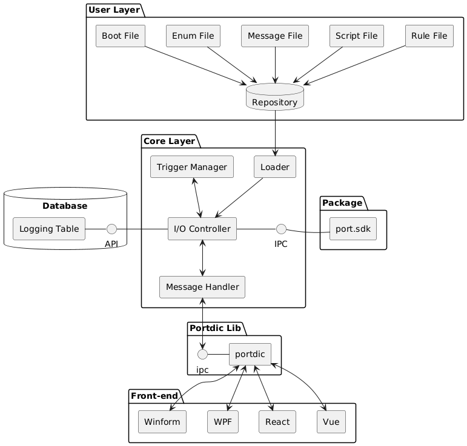

# Welcome to Port

`More Easily Create an API-Server with Port App`, designed to streamline the deployment of pkgs for developers. With this tool, developers can effortlessly deploy pkgs and integrate various applications to build a unified web service. Port Application simplifies the process, enabling developers to focus on creating seamless and efficient solutions with ease.

Please see the documentation [lincense](license.md)

## 1. Application Layout 

## 2. The Requirements 
---
* os         : windows 11+ / windows server 2003+
* memory     : minimum 32GB
* requirements : 

!!! tip
    System Requirements [.sdk-8.0.403-windows-x64-installer](https://dotnet.microsoft.com/ko-kr/download/dotnet/thank-you/sdk-8.0.403-windows-x64-installer){:download}

## 3. Download
---

VERSION | OS |STABLE | URL 
------|--------|--------|--------
v1.0.59 | Windows x64 | Yes | [v1.0.59-win-installer](file/Setup.zip){:port_win_installer} 

