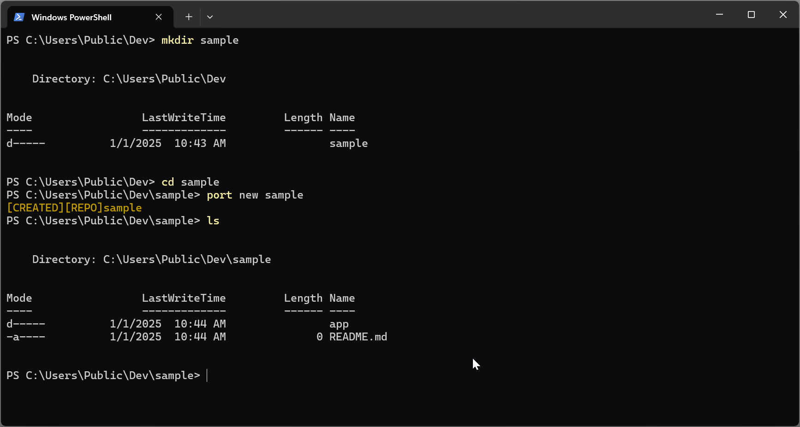
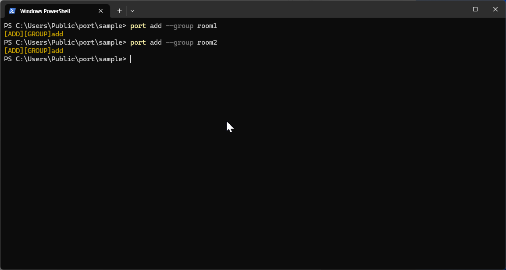
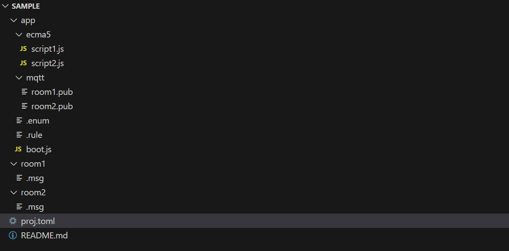

# Port Learning Guide

## Table of Contents
1. [Overview](#overview)
2. [Creating Port Projects](#creating-port-projects)
3. [Entry System](#entry-system)
4. [Enum Definitions](#enum-definitions)
5. [Rule System](#rule-system)

## Overview

Port operates by reflecting messages in the most recently updated repository. This quick start guide will help you understand how to create, configure, and manage Port projects effectively.

Port provides a comprehensive ecosystem for:

| Feature | Description |
|---------|-------------|
| **Entry-based Communication** | Structured data exchange between components |
| **Package Integration** | Modular architecture with reusable components |
| **Real-time Monitoring** | Live project status and logging capabilities |
| **Remote Management** | SSH and web-based administration |
| **IoT Integration** | MQTT protocol support for device communication |


## Creating Port Projects

### Project Structure Overview {#project-structure}

Port projects are organized hierarchically with a clear folder structure:

| Component | Description |
|-----------|-------------|
| **Root Folder** | Contains project configuration and `*.enum` files |
| **Category Folders** | Organize messages by functional areas |
| **Page Files** | Individual `*.page` files defining entry |

### Repository Setup {#repository-setup}

The Port project structure is simple and straightforward. Follow these steps to create your first project:

1. **Create Project Directory**: Start with a dedicated project folder
2. **Initialize Project**: Use `port new [project-name]` to generate project files
3. **Add Category**: Create sub-folders for message organization
4. **Define Messages**: Add `*.page` files to group folders
5. **Configure Types**: Specify text, num, and enum data types
6. **Deploy**: Use `port push` to store project configuration

!!! tip "Repository Naming Rules"
    Repository names cannot contain special characters and must follow operating system directory naming conventions.

#### Creating a New Project {#creating-new-project}



**Command:**
```bash
port new [project-name]
```

### Category Management {#group-management}

Categorys serve as logical containers for related messages. Each group can contain multiple message files, enabling organized and abstracted message management.

#### Adding Categorys {#adding-groups}



**Benefits of Categorys:**

| Benefit | Description |
|---------|-------------|
| **Organization** | Logical separation of message types |
| **Maintainability** | Easier to locate and edit related messages |
| **Scalability** | Support for large projects with many messages |
| **Abstraction** | Simplified management of complex message relationships |

#### Sample Project Structure {#sample-project-structure}



**Download Sample:**
[Download Sample Project](file/sample.zip)

## Entry System

### Entry Definition Syntax {#message-syntax}

Messages are the core communication units in Port. Each message is defined using a specific syntax:

```
[key] [datatype] [option...]
```

**Components:**

| Component | Description |
|-----------|-------------|
| **`[key]`** | Unique identifier within the message group |
| **`[datatype]`** | Data type specification (text, num, enum) |
| **`[option...]`** | Additional attributes and configurations |

### Data Types {#data-types}

Port supports three primary data types for message definitions:

| Name | Range | Description |
|------|-------|-------------|
| **char** | `0~255` | Fixed-length string type with maximum 255 characters for text storage |
| **num** | `-1.7e+308 ~ +1.7e+308` | Floating-point type supporting wide range of decimal values |
| **enum** | `0 ~ 65535` | User-defined fixed list from `.enum` files with efficient storage |

### Entry Attributes {#message-attributes}

Attributes provide additional functionality and behavior for messages:

| Attribute | Description |
|-----------|-------------|
| **pkg** | Real-time synchronization with external libraries (see package documentation) |
| **backup** | Automatic database backup with restore on application restart |
| **property** | Custom property specifications for message configuration |
| **rule** | Value validation and management rules |
| **logging** | Automatic logging support for message operations |

!!! warning "Special Characters"
    Message documents should not use special characters in identifiers.

### Entry Examples {#message-examples}

```
BulbOnOff     enum.OffOn  pkg:Bulb1.OffOn
RoomTemp1     num         pkg:Heater1.Temp  property:{"MIN":0,"MAX":300,"Arguments":"C"}
RoomTemp2     num         pkg:Heater1.Temp  property:{"MIN":0,"MAX":300,"Arguments":"F"}
```

**Explanation:**

| Variable | Type | Description |
|----------|------|-------------|
| **BulbOnOff** | Enum | Enum-based control linked to Bulb1 package |
| **RoomTemp1** | Numeric | Numeric temperature in Celsius with validation range |
| **RoomTemp2** | Numeric | Numeric temperature in Fahrenheit with validation range |

## Enum Definitions

### Enum Syntax {#enum-syntax}

Enums provide a way to define fixed sets of named values, improving code readability and reducing errors.

**Format:**
```
[key] [item-name:number_key] [item-name:number_key] ...
```

**Components:**

| Component | Description |
|-----------|-------------|
| **`[key]`** | Unique enum identifier |
| **`[item-name]`** | Descriptive name for enum value |
| **`[number_key]`** | Numeric value associated with the item |

### Enum Benefits {#enum-benefits}

Enums are particularly useful for:

| Use Case | Description |
|----------|-------------|
| **Fixed Value Sets** | Days of the week, months, status codes |
| **Code Clarity** | Self-documenting code with named constants |
| **Error Prevention** | Type safety instead of raw numeric values |
| **Maintenance** | Centralized value management |

### Enum Examples {#enum-examples}

```
TFalse      True:0      False:1
FTrue       False:0     True:1
OffOn       Off:0       On:1
OnOff       On:0        Off:1
```

**Use Cases:**

| Use Case | Description |
|----------|-------------|
| **Boolean States** | True/False, On/Off toggles |
| **Status Indicators** | Active/Inactive, Enabled/Disabled |
| **Mode Selection** | Manual/Automatic, Local/Remote |

## Rule System

### Rule Definition {#rule-definition}

Rules provide conditional logic for message validation and automatic actions. They are defined in `*.rule` files within group folders.

### SetTrigger Rules {#settrigger-rules}

SetTrigger rules control user modification permissions through conditional validation.

#### Syntax {#settrigger-syntax}
```javascript
set("<Input Condition>", "<Validation Condition>");
```

**Components:**

| Component | Description |
|-----------|-------------|
| **Input Condition** | Logical expression specifying the input to validate |
| **Validation Condition** | Expression that must evaluate to true for acceptance |

#### SetTrigger Examples {#settrigger-examples}
```javascript
set("room1.BulbOnOff==Off", "(room1.RoomTemp1>=20)&&(room2.RoomTemp2>=20)")
set("room1.RoomTemp2>=30", "room2.RoomTemp2>=5")
```

### GetTrigger Rules {#gettrigger-rules}

GetTrigger rules execute automatic actions when specified conditions are met.

#### Syntax {#gettrigger-syntax}
```javascript
get("<Trigger Condition>", "<Action Script>");
```

**Components:**

| Component | Description |
|-----------|-------------|
| **Trigger Condition** | Boolean expression for condition evaluation |
| **Action Script** | Instructions executed when condition is true |

#### GetTrigger Examples {#gettrigger-examples}
```javascript
get("(room1.RoomTemp1>=0)&&(room2.RoomTemp2>=0)", "room1.BulbOnOff=Off;room2.BulbOnOff=Off;")
```

### Rule Benefits {#rule-benefits}

| Benefit | Description |
|---------|-------------|
| **Validation** | Enforce business logic and data integrity |
| **Automation** | Trigger actions based on system state |
| **Safety** | Prevent invalid configurations |
| **Efficiency** | Reduce manual intervention needs |
