# Port Learning Guide

## Table of Contents
1. [Overview](#overview)
2. [Creating Port Projects](#creating-port-projects)
3. [Message System](#message-system)
4. [Enum Definitions](#enum-definitions)
5. [Rule System](#rule-system)
6. [Package Management](#package-management)
7. [Package Development](#package-development)
8. [PortDic SDK](#portdic-sdk)
9. [Project Execution](#project-execution)
10. [Logging and Monitoring](#logging-and-monitoring)
11. [Remote Access](#remote-access)
12. [MQTT Integration](#mqtt-integration)

## Overview

Port operates by reflecting messages in the most recently updated repository. This quick start guide will help you understand how to create, configure, and manage Port projects effectively.

Port provides a comprehensive ecosystem for:
- **Message-based Communication**: Structured data exchange between components
- **Package Integration**: Modular architecture with reusable components  
- **Real-time Monitoring**: Live project status and logging capabilities
- **Remote Management**: SSH and web-based administration
- **IoT Integration**: MQTT protocol support for device communication

## Creating Port Projects

### Project Structure Overview {#project-structure}

Port projects are organized hierarchically with a clear folder structure:

- **Root Folder**: Contains project configuration and `*.enum` files
- **Group Folders**: Organize messages by functional areas
- **Message Files**: Individual `*.msg` files defining message properties

### Repository Setup {#repository-setup}

The Port project structure is simple and straightforward. Follow these steps to create your first project:

1. **Create Project Directory**: Start with a dedicated project folder
2. **Initialize Project**: Use `port new [project-name]` to generate project files
3. **Add Groups**: Create sub-folders for message organization
4. **Define Messages**: Add `*.msg` files to group folders
5. **Configure Types**: Specify text, num, and enum data types
6. **Deploy**: Use `port push` to store project configuration

!!! tip "Repository Naming Rules"
    Repository names cannot contain special characters and must follow operating system directory naming conventions.

#### Creating a New Project {#creating-new-project}


**Command:**
```bash
port new [project-name]
```

### Group Management {#group-management}

Groups serve as logical containers for related messages. Each group can contain multiple message files, enabling organized and abstracted message management.

#### Adding Groups {#adding-groups}


**Benefits of Groups:**
- **Organization**: Logical separation of message types
- **Maintainability**: Easier to locate and edit related messages
- **Scalability**: Support for large projects with many messages
- **Abstraction**: Simplified management of complex message relationships

#### Sample Project Structure {#sample-project-structure}

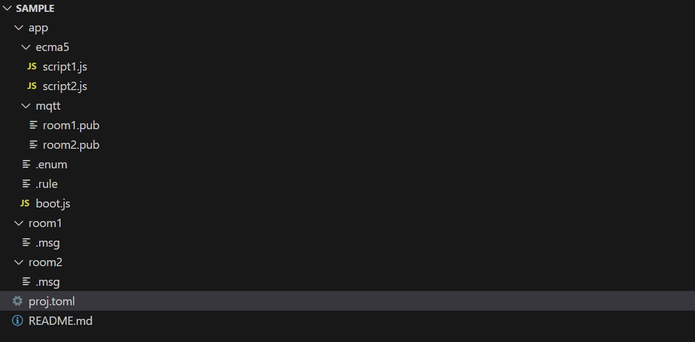

**Download Sample:**
[Download Sample Project](file/sample.zip)

## Message System

### Message Definition Syntax {#message-syntax}

Messages are the core communication units in Port. Each message is defined using a specific syntax:

```
[key] [datatype] [option...]
```

**Components:**
- **`[key]`**: Unique identifier within the message group
- **`[datatype]`**: Data type specification (text, num, enum)
- **`[option...]`**: Additional attributes and configurations

### Data Types {#data-types}

Port supports three primary data types for message definitions:

| Name | Range | Description |
|------|-------|-------------|
| **char** | `0~255` | Fixed-length string type with maximum 255 characters for text storage |
| **num** | `-1.7e+308 ~ +1.7e+308` | Floating-point type supporting wide range of decimal values |
| **enum** | `0 ~ 65535` | User-defined fixed list from `.enum` files with efficient storage |

### Message Attributes {#message-attributes}

Attributes provide additional functionality and behavior for messages:

| Attribute | Description |
|-----------|-------------|
| **pkg** | Real-time synchronization with external libraries (see package documentation) |
| **backup** | Automatic database backup with restore on application restart |
| **property** | Custom property specifications for message configuration |
| **rule** | Value validation and management rules |
| **logging** | Automatic logging support for message operations |

!!! warning "Special Characters"
    Message documents should not use special characters in identifiers.

### Message Examples {#message-examples}

```
BulbOnOff     enum.OffOn  pkg:Bulb1.OffOn
RoomTemp1     num         pkg:Heater1.Temp  property:{"MIN":0,"MAX":300,"Arguments":"C"}
RoomTemp2     num         pkg:Heater1.Temp  property:{"MIN":0,"MAX":300,"Arguments":"F"}
```

**Explanation:**
- **BulbOnOff**: Enum-based control linked to Bulb1 package
- **RoomTemp1**: Numeric temperature in Celsius with validation range
- **RoomTemp2**: Numeric temperature in Fahrenheit with validation range

## Enum Definitions

### Enum Syntax {#enum-syntax}

Enums provide a way to define fixed sets of named values, improving code readability and reducing errors.

**Format:**
```
[key] [item-name:number_key] [item-name:number_key] ...
```

**Components:**
- **`[key]`**: Unique enum identifier
- **`[item-name]`**: Descriptive name for enum value
- **`[number_key]`**: Numeric value associated with the item

### Enum Benefits {#enum-benefits}

Enums are particularly useful for:
- **Fixed Value Sets**: Days of the week, months, status codes
- **Code Clarity**: Self-documenting code with named constants
- **Error Prevention**: Type safety instead of raw numeric values
- **Maintenance**: Centralized value management

### Enum Examples {#enum-examples}

```
TFalse      True:0      False:1
FTrue       False:0     True:1
OffOn       Off:0       On:1
OnOff       On:0        Off:1
```

**Use Cases:**
- **Boolean States**: True/False, On/Off toggles
- **Status Indicators**: Active/Inactive, Enabled/Disabled
- **Mode Selection**: Manual/Automatic, Local/Remote

## Rule System

### Rule Definition {#rule-definition}

Rules provide conditional logic for message validation and automatic actions. They are defined in `*.rule` files within group folders.

### SetTrigger Rules {#settrigger-rules}

SetTrigger rules control user modification permissions through conditional validation.

#### Syntax {#settrigger-syntax}
```javascript
set("<Input Condition>", "<Validation Condition>");
```

**Components:**
- **Input Condition**: Logical expression specifying the input to validate
- **Validation Condition**: Expression that must evaluate to true for acceptance

#### SetTrigger Examples {#settrigger-examples}
```javascript
set("room1.BulbOnOff==Off", "(room1.RoomTemp1>=20)&&(room2.RoomTemp2>=20)")
set("room1.RoomTemp2>=30", "room2.RoomTemp2>=5")
```

### GetTrigger Rules {#gettrigger-rules}

GetTrigger rules execute automatic actions when specified conditions are met.

#### Syntax {#gettrigger-syntax}
```javascript
get("<Trigger Condition>", "<Action Script>");
```

**Components:**
- **Trigger Condition**: Boolean expression for condition evaluation
- **Action Script**: Instructions executed when condition is true

#### GetTrigger Examples {#gettrigger-examples}
```javascript
get("(room1.RoomTemp1>=0)&&(room2.RoomTemp2>=0)", "room1.BulbOnOff=Off;room2.BulbOnOff=Off;")
```

### Rule Benefits {#rule-benefits}

- **Validation**: Enforce business logic and data integrity
- **Automation**: Trigger actions based on system state
- **Safety**: Prevent invalid configurations
- **Efficiency**: Reduce manual intervention needs

## Package Management

### Package Overview {#package-overview}

Port packages are collections of pre-written code modules that provide specific functionality for reuse across projects.

**Package Benefits:**
1. **Reusability**: Share common code across multiple projects
2. **Efficiency**: Reduce development time by leveraging existing solutions
3. **Maintainability**: Organize code into manageable, modular components
4. **Dependency Management**: Simplified installation, updates, and tracking

### Package Discovery {#package-discovery}

#### Listing Available Packages {#listing-packages}


Use the package manager to browse and select available packages for your project.

### Boot Configuration {#boot-configuration}

#### boot.js Structure {#boot-js-structure}

The `boot.js` file initializes your application by importing and validating packages:

**Location:** `app/boot.js`

```javascript
import Bulb1 from 'BulbLib1'
import Bulb2 from 'BulbLib2'
import Heater1 from 'HeaterLib1'
import Heater2 from 'HeaterLib2'

function boot() {
    if (!Bulb1.Valid()) {
        console.log("invalid Bulb1");
        return false;
    }
    if (!Bulb2.Valid()) {
        console.log("invalid Bulb2");
        return false;
    }
    if (!Heater1.Valid()) {
        console.log("invalid Heater1");
        return false;
    }
    if (!Heater2.Valid()) {
        console.log("invalid Heater2");
        return false;
    }
    
    return true;
}
```

**Validation Process:**
1. **Import Packages**: Load required package modules
2. **Validate Each Package**: Check package integrity and dependencies
3. **Error Handling**: Stop boot process if validation fails
4. **Success Confirmation**: Return true when all packages are valid

## Package Development

### Package Development Overview {#package-development-overview}

The Port package system allows developers to create reusable libraries by inheriting from `PortObject` and linking them to Messages. This enables straightforward usage through Message calls and promotes modular development.

Port packages provide a standardized way to:
- Create reusable components
- Manage dependencies and configurations  
- Enable seamless integration with the Port ecosystem
- Facilitate API-driven interactions

### Package Downloads and Availability {#package-downloads-availability}

The following packages are available across different programming languages and platforms:

| NAME | Language | Package Manager | OS | STABLE |
|------|----------|-----------------|----| -------|
| portdic | C++ | not yet | Windows | No |
| portdic | Delphi | not yet | Windows | No |
| portdic | C# | nuget | Windows | Yes |
| portdic | Python | not yet | Windows | No |
| portdic | Javascript | npm | Any | Yes |

### Package Annotations System {#package-annotations-system}

Port packages use annotations to define behavior, configuration, and API endpoints. These annotations provide metadata that the Port system uses for:

- **Class Registration**: Identifying Port-managed classes
- **API Generation**: Creating REST endpoints automatically
- **Dependency Injection**: Managing services and resources
- **Validation**: Ensuring data integrity and business rules

#### Annotation Reference {#annotation-reference-detailed}

| Name | Targets | Type | Arguments | Description |
|------|---------|------|-----------|-------------|
| [Port](#port-annotation-detailed) | class | `-` | `Class Type` | Declares a class as Port-managed for package registration |
| [Valid](#valid-annotation-detailed) | method, property | `bool` | `invalid comment` | Defines validation logic with custom error messages |
| [Message](#message-annotation-detailed) | property | `string`, `double` | `-` | Creates API endpoints for property access |
| [Logger](#logger-annotation-detailed) | property | `ILogger` | `-` | Enables dependency injection for logging services |
| [Property](#property-annotation-detailed) | property | `IProperty` | `Message name` | Maps properties to pre-declared Message Properties |
| [EnumCode](#enumcode-annotation-detailed) | enum | `-` | `-` | Exposes enum values through API endpoints |
| [Comment](#comment-annotation-detailed) | property | `-` | `comment text` | Provides API documentation for properties |

### Detailed Annotation Usage {#detailed-annotation-usage}

#### Valid Annotation {#valid-annotation-detailed}

The `Valid` annotation defines validation logic for methods or properties, with custom error messages for validation failures.

```csharp
[Valid("Invalid for connection")]
public bool Valid()
{
    return true;
}
```

**Usage:**
- Applied to methods returning `bool`
- Provides custom error messages for validation failures
- Automatically called during package validation

#### Port Annotation {#port-annotation-detailed}

The `Port` annotation indicates that a class is managed within the Port Package system.

```csharp
using portpackage;
using portdatatype;

[Port(typeof(Heater))]
public class Heater
{
    // Implementation
}
```

**Usage:**
- Applied to class declarations
- Registers the class with the Port system
- Enables package management and API generation

#### Logger Annotation {#logger-annotation-detailed}

The `Logger` annotation specifies that a field should be injected with a logging system or service.

```csharp
using portpackage;
using portdatatype;

[Logger]
public ILogger Logger { get; set; }

// Usage example
Logger.Write(string.Join(",", values));
```

**Usage:**
- Applied to `ILogger` properties
- Enables dependency injection for logging
- Provides centralized logging capabilities

#### Property Annotation {#property-annotation-detailed}

The `Property` annotation maps a property to declared Message Properties for configuration access.

```csharp
using portpackage;
using portdatatype;

[Property]
public IProperty Property { get; set; }

// Usage example
if (this.Property.TryToGetValue("Unit", out string value))
{
    // Handle configuration value
}
```

**Usage:**
- Applied to `IProperty` properties
- Enables access to configuration values
- Supports key-value property retrieval

#### Message Annotation {#message-annotation-detailed}

Properties declared with `Message` annotation become API endpoints, accessible via REST API.

```csharp
using portpackage;
using portdatatype;

private static Random r = new Random(100);

[Message(PortDataType.Num, PropertyFormat.Json, "Unit")]
public double Temp
{
    get
    {
        try
        {
            if (this.Property != null)
            {
                if (this.Property.TryToGetValue("Unit", out string v1) && (v1 == "F"))
                {
                    return (r.NextDouble() * 9 / 5) + 32;
                }
                else if (this.Property.TryToGetValue("Unit", out string v2) && (v2 == "C"))
                {
                    return (r.NextDouble());
                }
                else
                {
                    return double.NaN;
                }
            }
            return double.NaN;
        }
        catch (Exception e)
        {
            if (Logger != null)
                Logger.Write(e.Message);
        }
        return double.NaN;
    }
}
```

**Usage:**
- Applied to properties with get/set accessors
- Creates REST API endpoints automatically
- Supports various data types and formats

#### EnumCode Annotation {#enumcode-annotation-detailed}

The `EnumCode` annotation exposes enum values through API endpoints for external access.

```csharp
[EnumCode]
public enum TestEnum : ushort
{
    _ = 0,
    TestEnumItem1,
    TestEnumItem2,
}
```

**Usage:**
- Applied to enum declarations
- Makes enum values accessible via API
- Enables external systems to query enum information

#### Comment Annotation {#comment-annotation-detailed}

The `Comment` annotation provides documentation for properties, exposed through the API.

```csharp
[Message, Comment("this is a numeric")]
public int NValue { get => 3; }
```

**Usage:**
- Applied alongside other annotations
- Provides API documentation
- Enhances developer experience with contextual information

### Creating .NET Packages {#creating-net-packages}

Port applications organize operations at the package level and functionality at the message level. All operations are defined within messages, enabling code reusability through message-based architecture.

#### Class Library Examples {#class-library-examples-detailed}

##### Bulb Package Example {#bulb-package-example-detailed}

```csharp
using portpackage;
using portdatatype;

[Port(typeof(Bulb))]
public class Bulb
{
    [Logger]
    public ILogger Logger { get; set; }

    [Property]
    public IProperty Property { get; set; }

    private SerialPortStream serialPort = new SerialPortStream();

    [Valid("")]
    public bool Valid()
    {
        return true;
    }

    private string comport;
    [Message(PortDataType.Text)]
    public string Comport
    {
        set
        {
            try
            {
                if (this.serialPort.PortName != value)
                {
                    this.serialPort = new SerialPortStream();
                    this.serialPort.PortName = value.ToString();
                    this.serialPort.BaudRate = 9600;
                    this.serialPort.DataBits = 8;
                    this.serialPort.StopBits = StopBits.One;
                    this.serialPort.Parity = Parity.Even;
                }
            }
            catch (System.Exception ex)
            {
                Logger.Write("[ERROR]" + ex.Message);
            }
        }
        get
        {
            return comport;
        }
    }

    private string offon = string.Empty;
    [Message(PortDataType.Enum, PropertyFormat.Json)]
    public string OffOn
    {
        set
        {
            var prop = this.Property;
            try
            {
                if (prop != null)
                { 
                    this.offon = value;
                }
            }
            catch (Exception ex)
            {
                Logger.Write("[ERROR]" + ex.Message);
            }
        }
        get
        {
            return this.offon;
        }
    }
}
```

##### Heater Package Example {#heater-package-example-detailed}

```csharp
using portpackage;
using portdatatype;

[Port(typeof(Heater))]
public class Heater
{
    [Logger]
    public ILogger Logger { get; set; }
    
    [Property]
    public IProperty Property { get; set; }
    
    [Message(PortDataType.Text)]
    public string Power { set; get; }
    
    [Valid("Invalid for connection")]
    public bool Valid()
    {
        return true;
    }
    
    private static Random r = new Random(100);
    
    [Message(PortDataType.Num, PropertyFormat.Json, "Unit")]
    public double Temp
    {
        get
        {
            try
            {
                if (this.Property != null)
                {
                    if (this.Property.TryToGetValue("Unit", out string v1) && (v1 == "F"))
                    {
                        var ret = (r.NextDouble() * 9 / 5) + 32;
                        return ret == 0 ? 1 : ret;
                    }
                    else if (this.Property.TryToGetValue("Unit", out string v2) && (v2 == "C"))
                    {
                        var ret = (r.NextDouble());
                        return ret == 0 ? 1 : ret;
                    }
                    else
                    {
                        return double.NaN;
                    }
                }
                return double.NaN;
            }
            catch (Exception e)
            {
                if (Logger != null)
                    Logger.Write(e.Message);
            }
            return double.NaN;
        }
    }
}
```

!!! warning "Array Declaration Warning"
    When creating a library in a .NET environment, declaring an excessively large array may result in a PrivateImplementationDetails error. It is recommended to use a List instead.

### Publishing Libraries {#publishing-libraries-detailed}

#### Prerequisites {#prerequisites-detailed}

Before publishing your .NET Core project, ensure you have the following:

- **[.NET SDK](https://dotnet.microsoft.com/download)**: Install the latest version
- **[C# Extension](https://marketplace.visualstudio.com/items?itemName=ms-dotnettools.csharp)**: Install in Visual Studio Code
- **Verified Build**: Ensure your project builds and runs correctly:

```bash
dotnet build
dotnet run
```

#### Basic Publish Commands {#basic-publish-commands-detailed}

##### Standard Release Build

```bash
dotnet publish -c Release -o ./publish
```

- `-c Release`: Builds in Release mode
- `-o ./publish`: Specifies output folder

##### Platform-Specific Publishing

```bash
dotnet publish -c Release -r win-x64 --self-contained false
```

**Available Runtimes:**
- `win-x64`: Windows 64-bit
- `linux-x64`: Linux 64-bit  
- `osx-x64`: macOS 64-bit

#### Automation with VS Code Tasks {#automation-vscode-tasks}

Create `.vscode/tasks.json` to automate publishing:

```json
{
    "version": "2.0.0",
    "tasks": [
        {
            "label": "Publish .NET Core",
            "command": "dotnet",
            "type": "process",
            "args": [
                "publish",
                "-c",
                "Release",
                "-o",
                "./publish"
            ],
            "problemMatcher": "$msCompile"
        }
    ]
}
```

**To run the task:**
1. Open Command Palette (`Ctrl+Shift+P`)
2. Select `Tasks: Run Task`
3. Choose `Publish .NET Core`

#### Deployment Options {#deployment-options-detailed}

##### Local Deployment
Copy published files to target server or hosting environment.

##### Docker Deployment
Create a `Dockerfile` for containerization:

```dockerfile
FROM mcr.microsoft.com/dotnet/aspnet:7.0 AS base
WORKDIR /app
COPY ./publish .
ENTRYPOINT ["dotnet", "YourApp.dll"]
```

#### Visual Studio 2022 Publishing {#vs2022-publishing}

For GUI-based publishing with Visual Studio 2022:

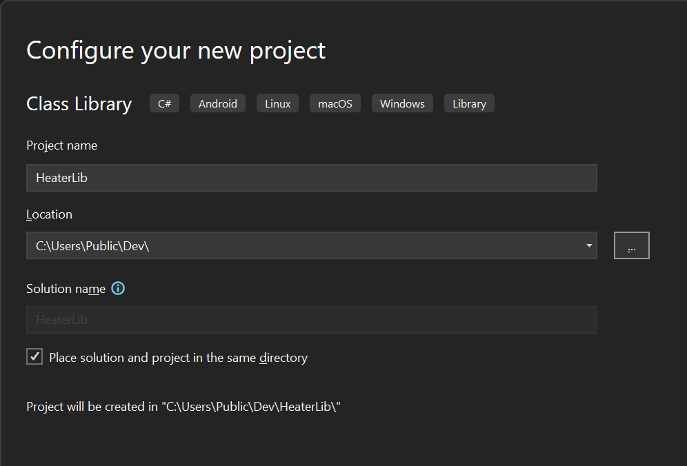

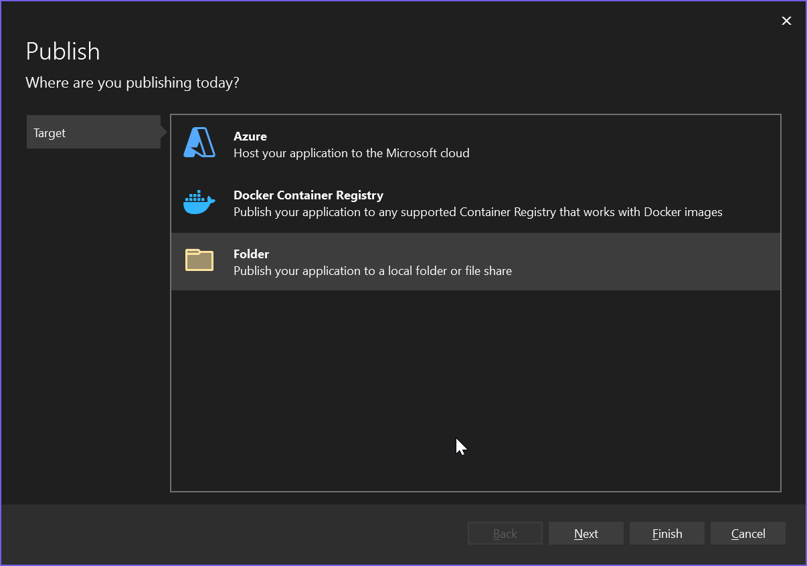

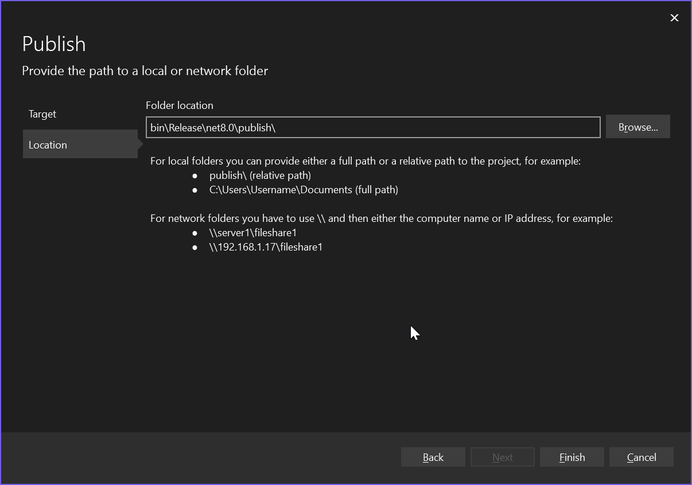

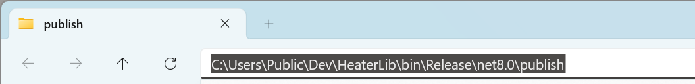

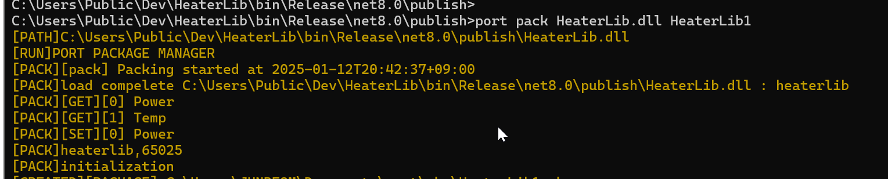

#### Troubleshooting Publishing {#troubleshooting-publishing}

##### Logging Output
To capture publish logs:

```bash
dotnet publish > publish_log.txt
```

##### Additional Resources
- [Official .NET Publish Documentation](https://learn.microsoft.com/en-us/dotnet/core/tools/dotnet-publish)
- [Visual Studio Code Documentation](https://code.visualstudio.com/docs)

### Package Creation and Management {#package-creation-management}

#### Creating Package Files {#creating-package-files-detailed}

After publishing your library, create a Port package using the following steps:

##### 1. Navigate to Publish Directory
```bash
cd [Publish target location]
```

##### 2. Pack the Library
```bash
port pack [dllname] [pkg-name]
```

##### 3. Verify Package Creation
Check the console output for successful packaging:

```
PS C:\Users\Public\Dev\publish> port pack HeaterLib.dll HeaterLib1
[PATH]C:\Users\Public\Dev\publish\HeaterLib.dll
[ALREADY_RUN]PORT PACKAGE MANAGER
[RUN]PORT PACKAGE MANAGER
[PACK][pack] Packing started at 2025-01-07T21:17:19+09:00
[PACK]load complete C:\Users\Public\Dev\publish\HeaterLib.dll : heaterlib
[PACK][GET][0] Power
[PACK][GET][1] Temp
[PACK][SET][0] Power
[PACK]heaterlib,65025
[PACK]initialization
[CREATED][PACKAGE] ...\port\pkg\HeaterLib1.pkg
```

#### Package Structure Analysis {#package-structure-analysis}

The packaging process includes:

1. **Analysis**: Scans the DLL for Port annotations
2. **Extraction**: Identifies all Message properties and methods
3. **Validation**: Ensures package integrity
4. **Creation**: Generates `.pkg` file in the Port package directory

#### Package Distribution {#package-distribution}

Once created, packages can be:
- Loaded into Port applications
- Distributed to other environments
- Managed through the Port Package Manager
- Accessed via REST API endpoints

## PortDic SDK

### PortDic Overview {#portdic-overview}

PortDic is a key-value pair data structure storage object provided by Port. It enables users to quickly look up values using keys, allowing for efficient data retrieval. This structure supports storage and editing of multiple data structures, facilitating stable and reliable development.

### PortDic Platform Support {#portdic-platform-support}

| NAME | Language | Package Manager | OS | STABLE |
|------|----------|-----------------|----| -------|
| portdic | C++ | not yet | Windows | No |
| portdic | Delphi | not yet | Windows | No |
| portdic | C# | nuget | Windows | Yes |
| portdic | Python | not yet | Windows | No |
| portdic | Javascript | npm | Any | Yes |

### React Integration with Vite {#react-integration-vite}

#### Sample Project Setup {#react-sample-setup}

**Download Sample:**
[React Project Sample](file/react_sample_source.zip)

#### React Implementation {#react-implementation}

```javascript
import { useState, useEffect } from 'react'
import reactLogo from './assets/react.svg'
import viteLogo from '/vite.svg'
import './App.css'
import { CallPortdic } from 'portdic';

function App() {
  const [setValue, setSetValue] = useState("");
  const [count, setCount] = useState(0) 
  const [portdic, setPortdic] = useState(0); 
  
  useEffect(() => {
    CallPortdic("localhost:5001").then(setPortdic).catch(console.error); 
  }, []); 
  
  return (
    <>
      <div>
        <a href="https://vite.dev" target="_blank">
          
        </a>
        <a href="https://react.dev" target="_blank">
          
        </a>
      </div>
      <div style={{ display: "flex", gap: "20px", alignItems: "center" }}> 
        <button
          onClick={() => {
            const data = portdic.Execute("version");
            data
              .then((resp) => resp.json())
              .then((data) => {
                console.log("success received:", data);
              })
              .catch((error) => {
                console.error("error occurred:", error);
              });
          }}
        >
          Version
        </button> 
        <button
          onClick={() =>
            console.log(portdic.Get("room1", "RoomTemp3"))
          }
        >
          Get
        </button> 
        <div style={{ display: "flex", gap: "10px", alignItems: "center" }}>
          <input
            type="text"
            placeholder="Set Value"
            value={setValue}
            onChange={(e) => setSetValue(e.target.value)}
            style={{
              padding: "5px",
              fontSize: "14px",
              borderRadius: "4px",
              border: "1px solid #ccc",
            }}
          />
          <button
            onClick={() => {
              portdic.Set("room1", "RoomTemp3", setValue);
              console.log(`Set value: ${setValue}`);
            }}
          >
            Set
          </button>
        </div>
      </div>
      <h1>Vite + React</h1>
      <div className="card">
        <button onClick={() => setCount((count) => count + 1)}>
          count is {count}
        </button>
        <p>
          Edit <code>src/App.jsx</code> and save to test HMR
        </p>
      </div>
      <p className="read-the-docs">
        Click on the Vite and React logos to learn more
      </p>
    </>
  )
}

export default App
```

#### React Integration Demo {#react-integration-demo}

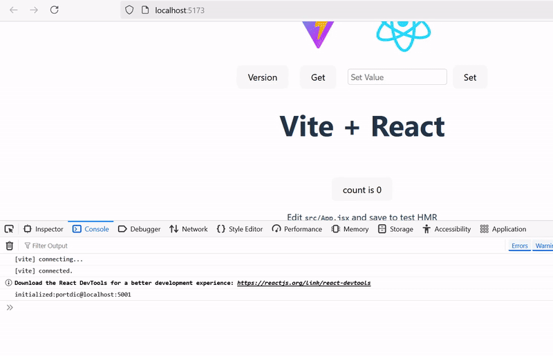

### .NET Integration {#dotnet-integration}

#### Initialization and Setup {#dotnet-initialization}

```csharp
private static IPortDic port = Port.GetDictionary("sample");

public Form()
{
   InitializeComponent();
   
   // Event handlers
   port.OnOccurred += Port_OnOccurred;
   port.OnStatusChanged += Port_OnStatusChanged;
   
   // Start the Port system
   port.Run(); 
}
```

#### Event Handling {#dotnet-event-handling}

##### Status Change Events

```csharp
/// <summary>
/// The OnStatusChanged event notifies when the port server status changes.
/// Provides details through PortStatusHandler.
/// </summary>
private void Port_OnStatusChanged(object sender, PortStatusArgs e)
{
    switch (e.Status)
    {
        case PortStauts.Initializing:
            break;
        case PortStauts.Running:
            OnReady = true;
            break;
        case PortStauts.Stopped:
            break;
        case PortStauts.Shutdown:
            break;
        case PortStauts.Failed:
            break;
    }
}
```

##### Occurrence Events

```csharp
/// <summary>
/// The OnOccurred event handles system events and messages.
/// Provides event details through PortEventArgs.
/// </summary>
private void Port_OnOccurred(object sender, PortEventArgs e)
{
    switch (e.EventType)
    {
        default:
            Console.WriteLine(e.Message);
            break;
    }
}
```

#### Test Package Integration {#test-package-integration}

```csharp
private static IPortDic port = Port.GetDictionary("sample");

public Form()
{
  InitializeComponent();
  
  // Test Mode: Heater Class with messages
  port.Test("Heater1", new Heater());

  port.OnOccurred += Port_OnOccurred;
  port.OnStatusChanged += Port_OnStatusChanged;
  
  port.Run();
}
```

#### SET/GET Operations {#dotnet-set-get-operations}

```csharp
// Setting values
var ok = dic.Set("room1", "BulbOnOff", "On");
if(ok){
    Console.WriteLine("ok");
} 

// Getting values - returns 'On'
Console.WriteLine(dic.Get("room1", "BulbOnOff").Text()); 

// Alternative syntax
port["room1"].Set("BulbOnOff", "Off"); 

// Getting values - returns 'Off'
Console.WriteLine(dic.Get("room1", "BulbOnOff").Text()); 

// Getting temperature values
var t1 = dic.Get("room1", "RoomTemp1");
// random number unit Celsius
Console.WriteLine(t1.Text()); 

var t2 = dic.Get("room1", "RoomTemp2");
// random number unit Fahrenheit
Console.WriteLine(t2.Text());
```

### PortDic Features {#portdic-features}

- **Efficient Lookup**: Fast key-value pair retrieval
- **Multi-platform Support**: Available across different programming languages
- **Real-time Updates**: Live data synchronization
- **Event-driven Architecture**: Responsive to system changes
- **Test Mode Support**: Package testing and validation
- **Type Safety**: Proper data type handling and conversion

## Project Execution

### Repository Updates {#repository-updates}

Before starting your project, ensure all changes are committed to the repository:

```bash
port push
```

### Console Execution {#console-execution}

#### Starting the Server {#starting-server}


**Command:**
```bash
port run [project-name]
```

**Process:**
1. **Upload Changes**: Use `port push` to sync repository
2. **Start Server**: Execute `port run [project-name]`
3. **Verify Operation**: Check console output for success/error messages

#### Error Handling {#error-handling}

!!! tip "Error Summarization"
    Use `--ng ignore` flag to summarize only error points:
    ```bash
    port run [project-name] --ng ignore
    ```
    
    **Detailed Error Analysis:**
    Visit [http://localhost:5001/api/app/ng/?view=table](http://localhost:5001/api/app/ng/?view=table) for comprehensive error details.

### GUI Application {#gui-application}

#### WPF Application Execution {#wpf-execution}


Use the graphical interface for easier project management and monitoring.

## Logging and Monitoring

### Log System Overview {#log-system}

Port Application maintains comprehensive logs for troubleshooting and system analysis across multiple categories.

### Log Categories {#log-categories}

**Log Directory:** `.../documents/port/logs`

| Folder | Purpose | Content |
|--------|---------|---------|
| **Pkg** | Package operations | Package loading events and activities |
| **Boot** | Resource loading | Project initialization and startup logs |
| **Console** | Command execution | Console commands and their outputs |
| **Service** | Port Package Manager | Service-related activities and status |
| **Project** | Project operations | Set/get operations and project-wide events |

### File-based Logging {#file-logging}


**Log Management:**
- **Automatic Creation**: Logs generated automatically during operations
- **Categorized Storage**: Separate folders for different log types
- **Troubleshooting**: Comprehensive information for issue diagnosis
- **System Analysis**: Performance and behavior tracking

### SSH Log Access {#ssh-log-access}

Retrieve logs remotely using SSH commands:

```bash
get sample.log
```


## Remote Access

### SSH Protocol Overview {#ssh-overview}

SSH (Secure Shell) provides secure remote access to Port systems for administration and monitoring.

### SSH Client Setup {#ssh-client-setup}

#### PuTTY Installation {#putty-installation}

PuTTY is a free, open-source terminal emulator supporting SSH, Telnet, and other network protocols.

!!! tip "Download PuTTY"
    [Download PuTTY Application](https://www.chiark.greenend.org.uk/~sgtatham/putty/latest.html)

### SSH Connection Process {#ssh-connection}

#### 1. Connection Configuration {#ssh-connection-config}

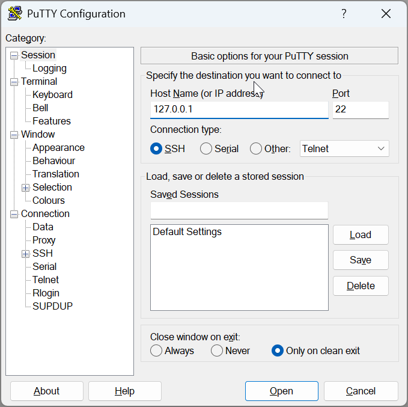

**Connection Details:**
- **Host**: `127.0.0.1`
- **Port**: `22`
- **Protocol**: SSH

!!! note "Default Credentials"
    - **Username**: `admin`
    - **Password**: `admin`

#### 2. Authentication {#ssh-authentication}

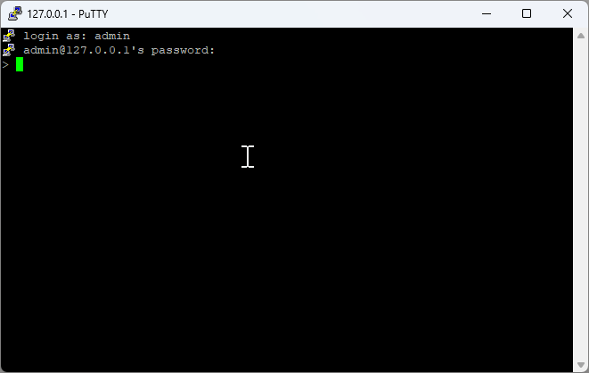

Enter your credentials when prompted to establish the secure connection.

#### 3. Command Execution {#ssh-commands}

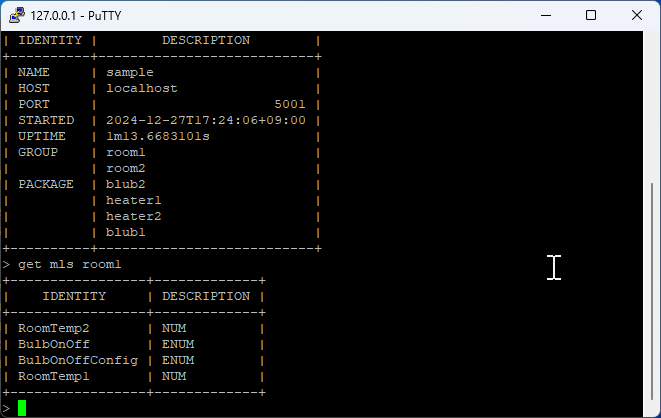

Once connected, you can execute various Port commands remotely:
- View system status
- Access log files
- Monitor project operations
- Perform administrative tasks

## MQTT Integration

### MQTT Protocol Overview {#mqtt-overview}

MQTT (Message Queuing Telemetry Transport) is a lightweight communication protocol designed for IoT devices and efficient message transmission in bandwidth-constrained environments.

### MQTT Architecture {#mqtt-architecture}

#### Core Components {#mqtt-components}

**1. Clients**
- **Publishers**: Send messages to specific topics
- **Subscribers**: Receive messages from subscribed topics
- **Dual Role**: Clients can both publish and subscribe

**2. Broker**
- **Message Distribution**: Central server managing message routing
- **Topic Management**: Handles topic subscriptions and publications
- **Client Coordination**: Manages connections and message delivery

**3. Topics**
- **Message Categories**: String-based channels for message organization
- **Hierarchical Structure**: Support for complex topic hierarchies (e.g., `home/livingroom/temperature`)
- **Subscription Management**: Clients subscribe to topics of interest

### MQTT Communication Flow {#mqtt-flow}

#### Connection Process {#mqtt-connection-process}

1. **Client Connection**: Connect to MQTT broker with IP address and port
2. **Authentication**: Provide credentials if required
3. **Topic Subscription**: Subscribe to relevant topics
4. **Message Publishing**: Publish messages to topics
5. **Message Distribution**: Broker delivers messages to subscribers
6. **Quality of Service**: Message delivery guarantees based on QoS level

#### Quality of Service Levels {#mqtt-qos}

| QoS Level | Guarantee | Description |
|-----------|-----------|-------------|
| **QoS 0** | At most once | No delivery guarantee, possible message loss |
| **QoS 1** | At least once | Guaranteed delivery, possible duplication |
| **QoS 2** | Exactly once | Guaranteed delivery without duplication |

### MQTT Configuration {#mqtt-configuration}

#### Connection Settings {#mqtt-connection-settings}

**Broker Details:**
- **Host**: `127.0.0.1`
- **Port**: `8080`
- **Username**: `admin`
- **Password**: `admin`

!!! note "Connection Credentials"
    Use the default credentials for local MQTT broker access.

### MQTT Explorer Setup {#mqtt-explorer-setup}

#### Publication Configuration {#mqtt-publication-config}

Create publication files in your project directory:

**File Path:** `../sample/app/mqtt/room1.pub`
**Relative Path:** `app/mqtt/room1.pub`

**File Content:**
```
room1 RoomTemp1  // [group-name] [message-name]
room2 RoomTemp1
```

#### MQTT Explorer Installation {#mqtt-explorer-installation}

!!! tip "Download MQTT Explorer"
    [MQTT Explorer Download](https://mqtt-explorer.com/)

#### Explorer Configuration {#mqtt-explorer-configuration}

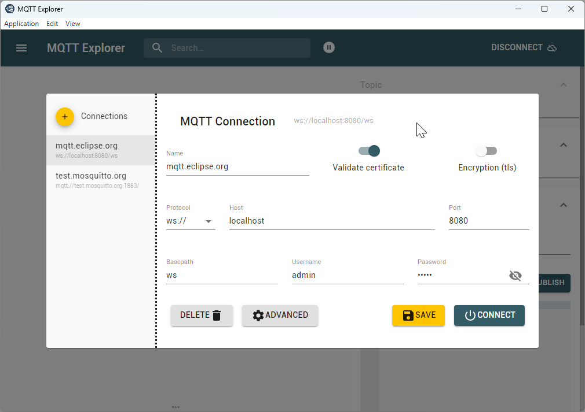

Configure the MQTT Explorer with your broker settings for real-time message monitoring.

#### Live Monitoring {#mqtt-live-monitoring}


Monitor real-time MQTT message flow and topic activity through the graphical interface.

### MQTT Integration Benefits {#mqtt-benefits}

- **Lightweight Protocol**: Minimal bandwidth usage for IoT applications
- **Real-time Communication**: Instant message delivery and updates
- **Scalable Architecture**: Support for numerous connected devices
- **Reliable Messaging**: QoS levels ensure appropriate delivery guarantees
- **Flexible Topics**: Hierarchical topic structure for organized messaging 
