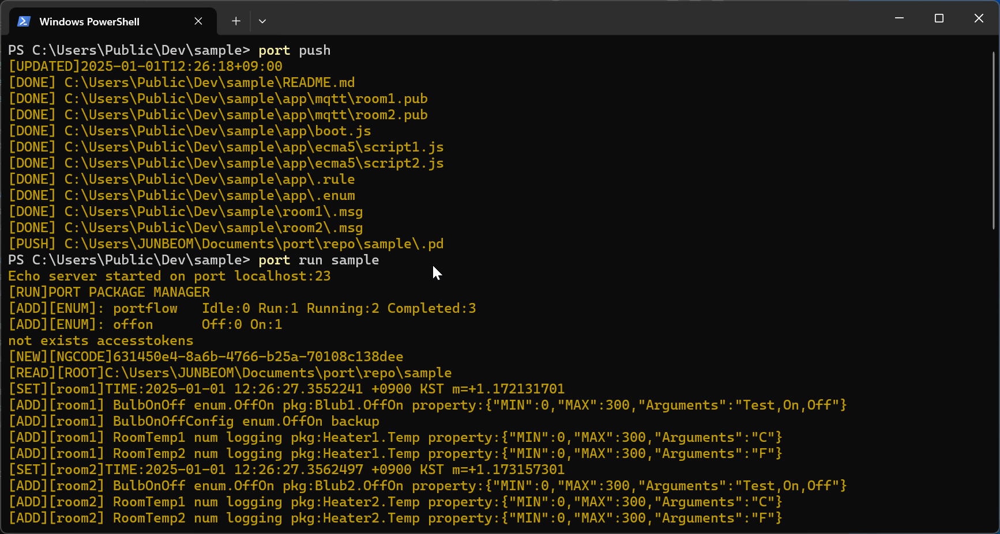
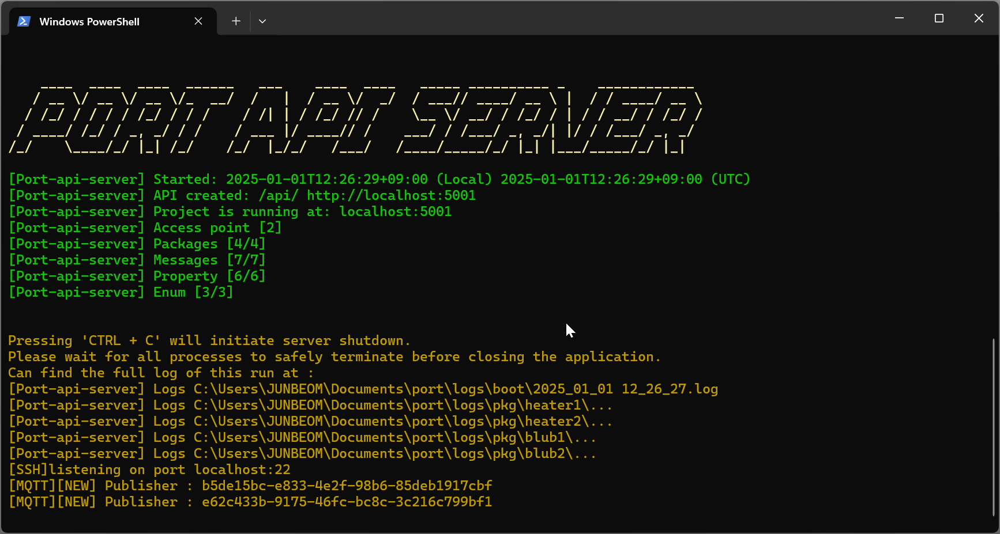
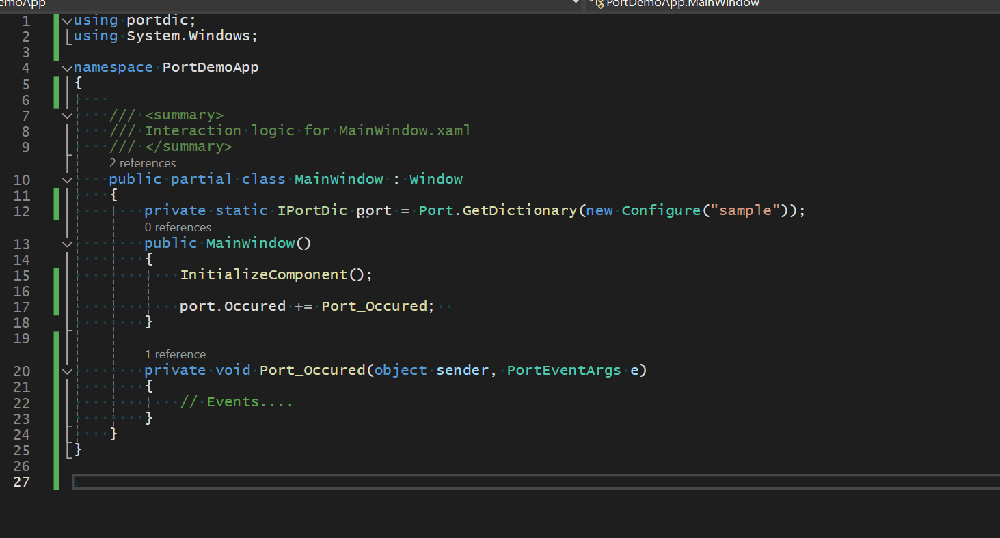
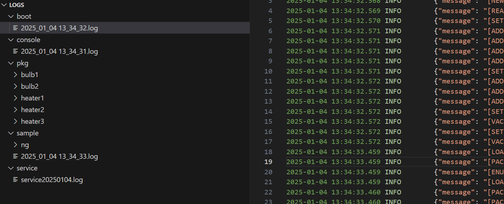
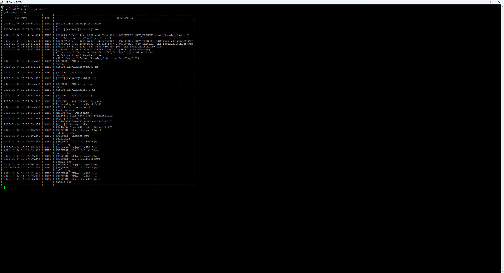

# Quick Start
___
Port operates by reflecting messages in the most recently updated repository. 
Try creating and editing a basic project to see how you can modify and configure projects. Follow along to understand the process better.


 
## How to create a port-project
___
Before starting a Port project, you need to create a root folder that defines your messages. The subfolders within this root folder are managed as groups by Port, allowing users to organize messages by group. The root folder contains files with the `*.enum` extension and the structure of sub-group folders. Within the sub-group folders, message definition documents with the `*.msg` extension are created.


### 1. Repository
___
The Port project is remarkably simple and straightforward. To get started, first create a project folder in the console, then type port new sample. This will quickly generate the project files. After that, create sub-group folders and add .msg files to each sub-group folder. Feel free to create messages using text, num, and enum types as you like. Once you've specified the attributes, type port push and Port will automatically store everything. Now, just run port run sample, and the server will start, allowing you to safely and easily share messages across multiple applications.
 
___

!!! tip
    The repository name cannot contain special characters. 
    It follows the directory naming rules provided by the operating system.
___
   

<h4>Create a project</h4>


### 2. Group 
A group serves as the root of messages. Within a single group, multiple message files can be stored, allowing for easy retrieval and editing. By managing several .msg files within the group folder, you can conveniently organize and abstract them for streamlined management.

___

<h4>Add a group</h4> 


 

#### Sample Project


___
Download [sample project](file/sample.zip){:sample} 
___


## How to add messages 
___
To declare a message, you need to edit the `*.msg` file in the sub-folder you created. By defining message data types and attributes as shown below, you can later utilize various features such as automatic logging and backup. Additionally, you can define relationships using predefined relations.

### 1. Message syntax
 `[key] [datatype] [option...]`

A message is an object that allows users to specify pkg properties in a pre-provided Application Service. The message is a kv, and types and properties can be defined in that message. 
Please attach the materials attached below. 
  
* `[key]`      - unique key in the message group
* `[datatype]` - text | num | enum 
* `[attribute]` - pkg,backup,rule,frame,property


#### datatype
name | range | description
 ------|--------|--------
 char | `0~255` | A fixed-length type with a total length of 255, where the variable is of the CHAR data type, allowing string values to be stored.
 num  | `-1.7e+308 ~` <p>`+1.7e+308`  | The floating-point type that allows for the representation of decimal numbers and is capable of representing a wide range of values, both very small and very large.
 enum | `0 ~ 65535` | The user can utilize the fixed list values specified in the .enum file, which can be used at a lower cost than text values and with stricter usage.  
  
#### attribute
 
 name|description
 ------|--------
 pkg     | Real-time synchronization and messaging are handled within the corresponding external library. For more details, please refer to the pkg documentation.
 backup  | Changes are saved to the backup database as they occur, ensuring that values are restored upon application restart. and values are not propagated pkg messages during program execution.
 property| Can specify a custom property
 rule    | Can specify rules to manage the values of corresponding messages.  
 logging | Auto logging support for messages 

!!! tip
    message document do not using special characters. 
 
### 2. Sample
``` 

 BulbOnOff     enum.OffOn  pkg:Bulb1.OffOn     
 RoomTemp1     num         pkg:Heater1.Temp  property:{"MIN":0,"MAX":300,"Arguments":"C"}
 RoomTemp2     num         pkg:Heater1.Temp  property:{"MIN":0,"MAX":300,"Arguments":"F"}        

```


## How to add enums
___

### 1. Enum syntax

Enums are particularly useful when you have a fixed set of values that a variable can take, such as days of the week, months of the year, or status codes. They help make your code more expressive, self-documenting, and less error-prone because you're working with named constants instead of raw integer values. 

* enum item format like this`[key] [item-name:number_key] [item-name:number_key]` 
* `[key]`      - unique key in the enum message
* `[item-name]`- name by enum-item
* `[property]` - unique key in enum value


### 2. Sample
```console
TFalse      True:0      False:1
FTrue       False:0     True:1
OffOn       Off:0       On:1
OnOff       On:0       Off:1
```

___


## How to add rules
___
To declare a rule, you need to edit the `*.rule` file in the sub-folder you created. The rule script can control whether the user can modify settings through the setable function. The first parameter is the condition that triggers the rule, and the second parameter is the condition that determines whether the setting is modifiable. When the user changes the message value, the function is automatically called to check these conditions.

<br/>

### 1. SetTrigger script syntax
The set function is a conditional validation mechanism used to check and enforce logical constraints before accepting input actions. It is composed of two main parts:
 
#### Input Condition
A logical expression that specifies the input condition to be validated.

#### Validation Condition
A logical expression that must evaluate to true for the input action to be accepted.

#### Syntax
set(`<Input Condition>`, `<Validation Condition>`);

<br/>

### 2. GetTrigger script syntax
  
The GetTrigger serves as a conditional trigger mechanism for executing specific actions when defined 
conditions are met. It is composed of two main parts:

#### Trigger Condition
A logical expression that evaluates to true or false.

#### Action Script
A set of instructions executed when the trigger condition evaluates to true.

#### Syntax
get(`<Trigger Condition>`, `<Action Script>`);

<br/>

### 3. Sample
```
    set("room1.BulbOnOff==Off","(room1.RoomTemp1>=20)&&(room2.RoomTemp2>=20)")
    set("room1.RoomTemp2>=30","room2.RoomTemp2>=5") 
    get("(room1.RoomTemp1>=0)&&(room2.RoomTemp2>=0)","room1.BulbOnOff=Off;room2.BulbOnOff=Off;")
```

## How to import packages
A port package, in the context of software development, is a collection of pre-written code or modules that provide specific functionality, designed to be reused across different projects. By incorporating port packages into your application, you can save time and effort by leveraging existing solutions instead of building everything from scratch. Port packages typically include libraries, utilities, or tools that handle common tasks, such as data manipulation, network communication, or file handling.

The main advantage of using port packages is that they promote reusability, allowing developers to share and reuse code, which improves efficiency and reduces redundancy. Additionally, port packages help to organize your code in a modular way, making it easier to maintain and update. it becomes much easier to install, update, and track dependencies, ensuring your application is always running with the right set of tools.

In summary, port packages:

1. Increase reusability by enabling the sharing of commonly used code.
2. Enhance efficiency by reducing the need to write code from scratch.
3. Improve maintainability by organizing code into smaller, manageable components.
4. Simplify management through package managers that handle installation, updates, and dependency tracking.


#### 1. Check packages list


<br>

#### 2. Manual for boot.js in Port Application

<br>
Overview
<br>
The boot.js file is a critical component of the Port Application. It initializes the system by importing and validating the necessary packages. If any package fails validation, the application stops booting and logs an error.

<br>
Location
<br>
The boot.js file is located in the app folder of the Port Application project. Ensure all edits are made directly in this file to modify the initialization process.

<br>
Structure of boot.js
<br>
Below is the typical structure of the boot.js file:
<br>

<div class="code-box">
  <pre>
  <code id="code-snippet" class="language-javascript"> 
  import Bulb1 from `BulbLib1`
  import Bulb2 from `BulbLib2`
  import Heater1 from `HeaterLib1`
  import Heater2 from `HeaterLib2`

  function boot(){ 
    if (!Bulb1.Valid()){
        console.log("invalid Bubl1");
        return false;
    }
    if (!Bulb2.Valid()){
        console.log("invalid Bubl2");
        return false;
    }
    if (!Heater1.Valid()){
        console.log("invalid Heater1");
        return false;
    }
    if (!Heater2.Valid()){
        console.log("invalid Heater2");
        return false;
    }

    return true;
  } 
  </code></pre>
  <button class="copy-button" onclick="copyCode('code-snippet')">
    
  </button>
</div> 


<br>


After linking the relations to your project, you can verify the integration using the following command


## How to start project 

Push to repository.

`port push`

### a. With console
Once all message definitions are complete, you can start the message server based on these definitions. Before running the server, upload all updated content to the local repository by entering `port push` in the console. Then, run the server with the command `port run [project-name]`.





!!!tip
    When running the server, if you include `--ng ignore` in the command, it will summarize only the points where errors (NG) occur. For detailed information on these NG points, you can visit the following URL to view the NG point table: 
    <p><a href="http://localhost:5001/api/app/ng/?view=table">http://localhost:5001/api/app/ng/?view=table</a></p>


### b. With application(WPF)





## How to check logs

Port Application records events and activities related to loaded packages, resource loading, console commands, services, and the overall project in various log folders. Logs play a vital role in troubleshooting and system analysis, providing users with crucial information and diagnostic tools.

### a. With log files

`.../documents/port/logs`

Port Application provides the following subfolders under the port/logs/ path. Each folder records logs for specific activities:

- Pkg Folder : 
Logs are created when a package is loaded, and all events related to the package are recorded.

- Boot Folder : 
Logs are created when resources needed for project execution are loaded.

- Console Folder : 
Logs commands invoked through the Port Application.

- Service Folder : 
Logs related to the Port Package Manager service.

- Project Folder : 
Logs related to set/get operations and overall project-related logs.




### b. With ssh

Enter the command in your ssh application
`get sample.log`




## How to use SSH

SSH is a network protocol used for secure remote access to a computer system. It provides a secure way to access a remote computer without having direct access to its network. SSH is commonly used to connect to remote servers, perform administrative tasks, and access files and directories.

### 1. Install Putty application


PuTTY is a popular free and open-source terminal emulator that supports various network protocols, such as SSH (Secure Shell), Telnet, and Rlogin. It is widely used for remotely accessing servers and systems over a network. PuTTY allows users to interact with remote machines via a command-line interface, making it a valuable tool for system administrators, developers, and IT professionals.

!!! Tip
    Download a [putty application](https://www.chiark.greenend.org.uk/~sgtatham/putty/latest.html){:download}

### 2. Connect to 127.0.0.1:22 
 


!!! Note
    port : 22 / username : admin / password : admin


### 3. Enter the username and password


### 4. Enter the commands 


## How to use MQTT
MQTT is a lightweight messaging protocol primarily designed for efficient message transmission between IoT (Internet of Things) devices. This protocol is optimized to work in environments with limited network bandwidth, offering fast and reliable communication. MQTT is based on a publish/subscribe model, simplifying interactions between clients that send and receive data.

### 1. MQTT Operation Flow

1.Clients

Clients can either publish messages to a specific topic or subscribe to topics to receive messages. A client can act as both a publisher and a subscriber.

2.Broker

The broker is the central server that manages message distribution. It receives messages from publishers and forwards them to subscribers who are subscribed to the relevant topic(s).

3.Topics

A topic is a string that represents the channel or category of a message. Clients subscribe to topics to receive messages. Topics can be hierarchical, allowing complex topic structures (e.g., home/livingroom/temperature).
Steps in MQTT Communication:

4.Connection

A client connects to the MQTT broker using a specific IP address and port. It may provide credentials for authentication.

### 2. Connect to 127.0.0.1:8080

A client subscribes to one or more topics of interest. This tells the broker which messages it wants to receive.

1.Publishing

Another client can publish a message to a topic. The broker will check which clients are subscribed to that topic.
Message Distribution:

The broker sends the message to all clients subscribed to the topic. The message is delivered according to the Quality of Service (QoS) level defined by the publisher and subscriber.

2.QoS Levels

QoS 0: Message is delivered at most once (no guarantee of delivery).
QoS 1: Message is delivered at least once (guaranteed delivery but possible duplication).
QoS 2: Message is delivered exactly once (guaranteed delivery without duplication).

3.Disconnect

After the communication, a client can disconnect from the broker, but the broker retains subscriptions for clients that maintain a persistent session.

4.Key Concepts

- Publish : A client sends a message to a topic (e.g., sending sensor data).
- Subscribe : A client listens to a specific topic to receive messagees.
- Broker : A server that handles the routing and delivery of messages.
- Topics : Categories or channels that messages are published to and subscribed from.

!!! Note
    port : 8080 / username : admin / password : admin


### 3. How to use Mqtt-explorer

First, you make *.pub file in your project directory

`path : ..\sample\app\mqtt\room1.pub`

`url  : app\mqtt\room1.pub`

``` 
room1 RoomTemp1 \\ [group-name] [message-name] 
room2 RoomTemp1
``` 


!!! Tip
    [mosquitto.org/download](https://mqtt-explorer.com/){:download} 


 
### 4. It's working!


<style>

.console {
    width: 80%;
    height: 80%;
    background-color: whitesmoke;
    color: black;
    padding: 20px;
    box-sizing: border-box;
    border-radius: 8px;
    box-shadow: 0 0 10px rgba(0, 0, 0, 0.5);
    overflow-y: auto;
}
.yellow{
    color:yellow;
}
.console-content {
    white-space: pre-wrap;
}

.console-content p {
    margin: 0;
}


.notepad {
    width: 100%;
    height: 80%;
    background-color: white;
    color: black;
    padding: 20px;
    box-sizing: border-box;
    border-radius: 8px;
    box-shadow: 0 0 10px rgba(0, 0, 0, 0.5);
    overflow-y: auto;
}

.notepad:before {
    content: '';
    position: absolute;
    top: 10px;
    left: 20px;
    right: 20px;
    height: 2px;
    background-color: #ccc;
}

.notepad:after {
    content: '';
    position: absolute;
    top: 30px;
    left: 20px;
    right: 20px;
    height: 2px;
    background-color: #ccc;
}

.notepad-content {
    margin-top: 40px;
}

.notepad-content p {
    margin: 0 0 10px;
    line-height: 1.5;
}

.code-box {
  position: relative;
  background: #f5f5f5;
  border: 1px solid #ddd;
  border-radius: 5px;
  padding: 15px;
  margin: 20px 0;
  overflow: auto;
  font-family: "Courier New", Courier, monospace;
}

/* Code Styling */
.code-box pre {
  margin: 0;
  overflow-x: auto;
  white-space: pre-wrap;
  word-wrap: break-word;
  background: none;
  padding: 0;
}

/* Copy Button */
.copy-button {
  position: absolute;
  top: 30px;
  right: 30px;  
  color: white;
  border: none;
  border-radius: 3px;
  padding: 5px 5px;
  font-size: 14px;
  cursor: pointer;
  transition: background-color 0.3s;

}

.copy-button:hover {
  background-color: #e5e5e5;
}
</style>

<script>
  function copyCode(elementId) {
  const codeElement = document.getElementById(elementId);
  const codeText = codeElement.innerText || codeElement.textContent;

  navigator.clipboard.writeText(codeText).then(() => {
    alert("Code copied to clipboard!");
  }).catch((error) => {
    console.error("Failed to copy code: ", error);
  });
}
</script>
<!-- Prism.js CSS (for syntax highlighting) -->
<link href="https://cdnjs.cloudflare.com/ajax/libs/prism/1.29.0/themes/prism.min.css" rel="stylesheet" />

<!-- Prism.js JavaScript (for syntax highlighting functionality) -->
<script src="https://cdnjs.cloudflare.com/ajax/libs/prism/1.29.0/prism.min.js"></script>