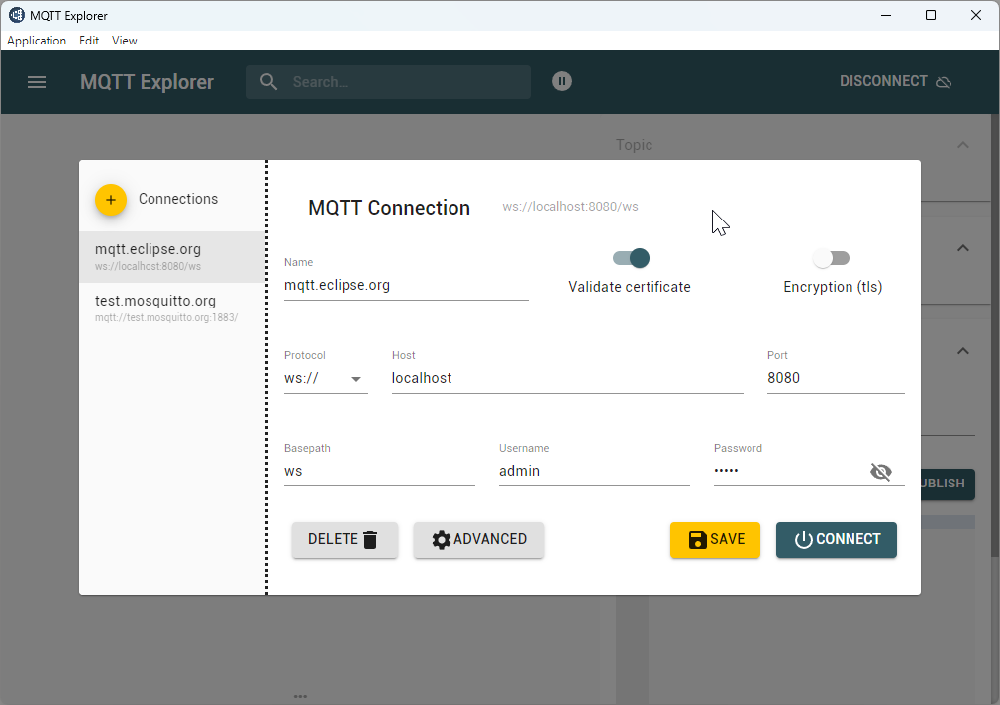

## Table of Contents

1. [MQTT Architecture](#mqtt-architecture)
2. [MQTT Communication Flow](#mqtt-flow)
3. [MQTT Configuration](#mqtt-configuration)
4. [MQTT Explorer Setup](#mqtt-explorer-setup)
5. [MQTT Integration Benefits](#mqtt-benefits)

## Overview {#mqtt-overview}

MQTT (Message Queuing Telemetry Transport) is a lightweight communication protocol designed for IoT devices and efficient message transmission in bandwidth-constrained environments.

### MQTT Architecture {#mqtt-architecture}

#### Core Components {#mqtt-components}

**1. Clients**
- **Publishers**: Send messages to specific topics
- **Subscribers**: Receive messages from subscribed topics
- **Dual Role**: Clients can both publish and subscribe

**2. Broker**
- **Message Distribution**: Central server managing message routing
- **Topic Management**: Handles topic subscriptions and publications
- **Client Coordination**: Manages connections and message delivery

**3. Topics**
- **Message Categories**: String-based channels for message organization
- **Hierarchical Structure**: Support for complex topic hierarchies (e.g., `home/livingroom/temperature`)
- **Subscription Management**: Clients subscribe to topics of interest

### MQTT Communication Flow {#mqtt-flow}

#### Connection Process {#mqtt-connection-process}

1. **Client Connection**: Connect to MQTT broker with IP address and port
2. **Authentication**: Provide credentials if required
3. **Topic Subscription**: Subscribe to relevant topics
4. **Message Publishing**: Publish messages to topics
5. **Message Distribution**: Broker delivers messages to subscribers
6. **Quality of Service**: Message delivery guarantees based on QoS level

#### Quality of Service Levels {#mqtt-qos}

| QoS Level | Guarantee | Description |
|-----------|-----------|-------------|
| **QoS 0** | At most once | No delivery guarantee, possible message loss |
| **QoS 1** | At least once | Guaranteed delivery, possible duplication |
| **QoS 2** | Exactly once | Guaranteed delivery without duplication |

### MQTT Configuration {#mqtt-configuration}

#### Connection Settings {#mqtt-connection-settings}

**Broker Details:**
- **Host**: `127.0.0.1`
- **Port**: `8080`
- **Username**: `admin`
- **Password**: `admin`

!!! note "Connection Credentials"
    Use the default credentials for local MQTT broker access.

### MQTT Explorer Setup {#mqtt-explorer-setup}

#### Publication Configuration {#mqtt-publication-config}

Create publication files in your project directory:

**File Path:** `../sample/app/mqtt/room1.pub`
**Relative Path:** `app/mqtt/room1.pub`

**File Content:**
```
room1 RoomTemp1  // [group-name] [message-name]
room2 RoomTemp1
```

#### MQTT Explorer Installation {#mqtt-explorer-installation}

!!! tip "Download MQTT Explorer"
    [MQTT Explorer Download](https://mqtt-explorer.com/)

#### Explorer Configuration {#mqtt-explorer-configuration}



Configure the MQTT Explorer with your broker settings for real-time message monitoring.

#### Live Monitoring {#mqtt-live-monitoring}


Monitor real-time MQTT message flow and topic activity through the graphical interface.

### MQTT Integration Benefits {#mqtt-benefits}

- **Lightweight Protocol**: Minimal bandwidth usage for IoT applications
- **Real-time Communication**: Instant message delivery and updates
- **Scalable Architecture**: Support for numerous connected devices
- **Reliable Messaging**: QoS levels ensure appropriate delivery guarantees
- **Flexible Topics**: Hierarchical topic structure for organized messaging 
