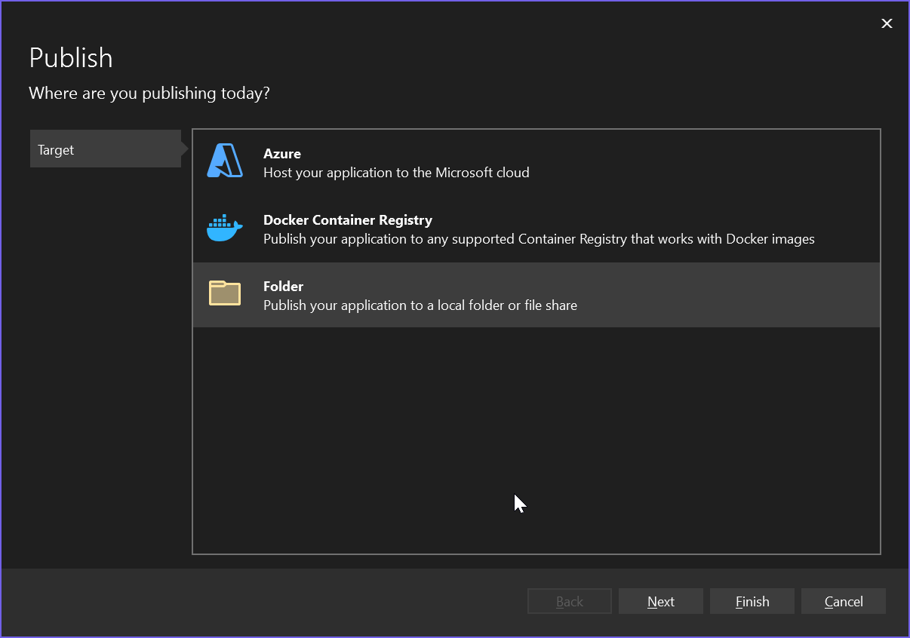
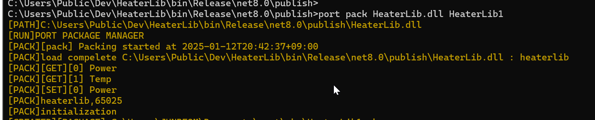

# Port Package Documentation

## Table of Contents
1. [Overview](#overview)
2. [Package Downloads](#package-downloads)
3. [Package Annotations](#package-annotations)
4. [Annotation Reference](#annotation-reference)
5. [Creating Packages (.NET)](#creating-packages-net)
6. [Publishing Libraries](#publishing-libraries)
7. [Package Management](#package-management)

## Overview

The Port package is a collection of reusable libraries designed for modular development. Users can create packages by inheriting from `PortObject` and link them to Messages, enabling straightforward usage through Message calls.

Port packages provide a standardized way to:
- Create reusable components
- Manage dependencies and configurations
- Enable seamless integration with the Port ecosystem
- Facilitate API-driven interactions

## Package Downloads

The following packages are available across different programming languages and platforms:

| NAME | Language | Package Manager | OS | STABLE |
|------|----------|-----------------|----| -------|
| portdic | C++ | not yet | Windows | No |
| portdic | Delphi | not yet | Windows | No |
| portdic | C# | nuget | Windows | Yes |
| portdic | Python | not yet | Windows | No |
| portdic | Javascript | npm | Any | Yes |

## Package Annotations

Port packages use annotations to define behavior, configuration, and API endpoints. These annotations provide metadata that the Port system uses for:

- **Class Registration**: Identifying Port-managed classes
- **API Generation**: Creating REST endpoints automatically
- **Dependency Injection**: Managing services and resources
- **Validation**: Ensuring data integrity and business rules

### Annotation Summary

| Name | Targets | Type | Arguments | Description |
|------|---------|------|-----------|-------------|
| [Port](#port-annotation) | class | `-` | `Class Type` | Declares a class as Port-managed for package registration |
| [Valid](#valid-annotation) | method, property | `bool` | `invalid comment` | Defines validation logic with custom error messages |
| [Entry](#message-annotation) | property | `string`, `double` | `-` | Creates API endpoints for property access |
| [Logger](#logger-annotation) | property | `ILogger` | `-` | Enables dependency injection for logging services |
| [Property](#property-annotation) | property | `IProperty` | `-` | Maps properties to pre-declared Properties |
| [EnumCode](#enumcode-annotation) | enum | `-` | `-` | Exposes enum values through API endpoints |
| [Comment](#comment-annotation) | property | `-` | `comment text` | Provides API documentation for properties |

## Annotation Reference

### Valid Annotation {#valid-annotation}

The `Valid` annotation defines validation logic for methods or properties, with custom error messages for validation failures.

```csharp
[Valid("Invalid for connection")]
public bool Valid()
{
    return true;
}
```

**Usage:**
- Applied to methods returning `bool`
- Provides custom error messages for validation failures
- Automatically called during package validation

### Port Annotation {#port-annotation}

The `Port` annotation indicates that a class is managed within the Port Package system.

```csharp
using portpackage;
using portdatatype;

[References(typeof(Heater))]
public class Heater
{
    // Implementation
}
```

**Usage:**
- Applied to class declarations
- Registers the class with the Port system
- Enables package management and API generation

### Logger Annotation {#logger-annotation}

The `Logger` annotation specifies that a field should be injected with a logging system or service.

```csharp
using portpackage;
using portdatatype;

[Logger]
public ILogger Logger { get; set; }

// Usage example
Logger.Write(string.Join(",", values));
```

**Usage:**
- Applied to `ILogger` properties
- Enables dependency injection for logging
- Provides centralized logging capabilities

### Property Annotation {#property-annotation}

The `Property` annotation maps a property to declared Message Properties for configuration access.

```csharp
using portpackage;
using portdatatype;

[Property]
public IProperty Property { get; set; }

// Usage example
if (this.Property.TryToGetValue("Unit", out string value))
{
    // Handle configuration value
}
```

**Usage:**
- Applied to `IProperty` properties
- Enables access to configuration values
- Supports key-value property retrieval

### Entry Annotation {#message-annotation}

Properties declared with `Entry` annotation become API endpoints, accessible via REST API.

```csharp
using portpackage;
using portdatatype;

private static Random r = new Random(100);

[Entry(PortDataType.Num, PropertyFormat.Json, "Unit")]
public double Temp
{
    get
    {
        try
        {
            if (this.Property != null)
            {
                if (this.Property.TryToGetValue("Unit", out string v1) && (v1 == "F"))
                {
                    return (r.NextDouble() * 9 / 5) + 32;
                }
                else if (this.Property.TryToGetValue("Unit", out string v2) && (v2 == "C"))
                {
                    return (r.NextDouble());
                }
                else
                {
                    return double.NaN;
                }
            }
            return double.NaN;
        }
        catch (Exception e)
        {
            if (Logger != null)
                Logger.Write(e.Message);
        }
        return double.NaN;
    }
}
```

**Usage:**
- Applied to properties with get/set accessors
- Creates REST API endpoints automatically
- Supports various data types and formats

### EnumCode Annotation {#enumcode-annotation}

The `EnumCode` annotation exposes enum values through API endpoints for external access.

```csharp
[EnumCode]
public enum TestEnum : ushort
{
    _ = 0,
    TestEnumItem1,
    TestEnumItem2,
}
```

**Usage:**
- Applied to enum declarations
- Makes enum values accessible via API
- Enables external systems to query enum information

### Comment Annotation {#comment-annotation}

The `Comment` annotation provides documentation for properties, exposed through the API.

```csharp
[Entry, Comment("this is a numeric")]
public int NValue { get => 3; }
```

**Usage:**
- Applied alongside other annotations
- Provides API documentation
- Enhances developer experience with contextual information

## Creating Packages (.NET)

Port applications organize operations at the package level and functionality at the message level. All operations are defined within messages, enabling code reusability through message-based architecture.

### Class Library Examples

#### Bulb Package {#bulb-package-example}

```csharp
using portpackage;
using portdatatype;

[References(typeof(Bulb))]
public class Bulb
{
    [Logger]
    public ILogger Logger { get; set; }

    [Property]
    public IProperty Property { get; set; }

    private SerialPortStream serialPort = new SerialPortStream();

    [Valid("")]
    public bool Valid()
    {
        return true;
    }

    private string comport;
    [Entry(PortDataType.Text)]
    public string Comport
    {
        set
        {
            try
            {
                if (this.serialPort.PortName != value)
                {
                    this.serialPort = new SerialPortStream();
                    this.serialPort.PortName = value.ToString();
                    this.serialPort.BaudRate = 9600;
                    this.serialPort.DataBits = 8;
                    this.serialPort.StopBits = StopBits.One;
                    this.serialPort.Parity = Parity.Even;
                }
            }
            catch (System.Exception ex)
            {
                Logger.Write("[ERROR]" + ex.Message);
            }
        }
        get
        {
            return comport;
        }
    }

    private string offon = string.Empty;
    [Entry(PortDataType.Enum, PropertyFormat.Json)]
    public string OffOn
    {
        set
        {
            var prop = this.Property;
            try
            {
                if (prop != null)
                { 
                    this.offon = value;
                }
            }
            catch (Exception ex)
            {
                Logger.Write("[ERROR]" + ex.Message);
            }
        }
        get
        {
            return this.offon;
        }
    }
}
```

#### Heater Package {#heater-package-example}

```csharp
using portpackage;
using portdatatype;

[References(typeof(Heater))]
public class Heater
{
    [Logger]
    public ILogger Logger { get; set; }
    
    [Property]
    public IProperty Property { get; set; }
    
    [Entry(PortDataType.Text)]
    public string Power { set; get; }
    
    [Valid("Invalid for connection")]
    public bool Valid()
    {
        return true;
    }
    
    private static Random r = new Random(100);
    
    [Entry(PortDataType.Num, PropertyFormat.Json, "Unit")]
    public double Temp
    {
        get
        {
            try
            {
                if (this.Property != null)
                {
                    if (this.Property.TryToGetValue("Unit", out string v1) && (v1 == "F"))
                    {
                        var ret = (r.NextDouble() * 9 / 5) + 32;
                        return ret == 0 ? 1 : ret;
                    }
                    else if (this.Property.TryToGetValue("Unit", out string v2) && (v2 == "C"))
                    {
                        var ret = (r.NextDouble());
                        return ret == 0 ? 1 : ret;
                    }
                    else
                    {
                        return double.NaN;
                    }
                }
                return double.NaN;
            }
            catch (Exception e)
            {
                if (Logger != null)
                    Logger.Write(e.Message);
            }
            return double.NaN;
        }
    }
}
```

!!! warning "Array Declaration Warning"
    When creating a library in a .NET environment, declaring an excessively large array may result in a PrivateImplementationDetails error. It is recommended to use a List instead.

## Publishing Libraries

### Prerequisites

Before publishing your .NET Core project, ensure you have the following:

- **[.NET SDK](https://dotnet.microsoft.com/download)**: Install the latest version
- **[C# Extension](https://marketplace.visualstudio.com/items?itemName=ms-dotnettools.csharp)**: Install in Visual Studio Code
- **Verified Build**: Ensure your project builds and runs correctly:

```bash
dotnet build
dotnet run
```

### Basic Publish Commands

#### Standard Release Build

```bash
dotnet publish -c Release -o ./publish
```

- `-c Release`: Builds in Release mode
- `-o ./publish`: Specifies output folder

#### Platform-Specific Publishing

```bash
dotnet publish -c Release -r win-x64 --self-contained false
```

**Available Runtimes:**
- `win-x64`: Windows 64-bit
- `linux-x64`: Linux 64-bit  
- `osx-x64`: macOS 64-bit

### Automation with VS Code Tasks

Create `.vscode/tasks.json` to automate publishing:

```json
{
    "version": "2.0.0",
    "tasks": [
        {
            "label": "Publish .NET Core",
            "command": "dotnet",
            "type": "process",
            "args": [
                "publish",
                "-c",
                "Release",
                "-o",
                "./publish"
            ],
            "problemMatcher": "$msCompile"
        }
    ]
}
```

**To run the task:**
1. Open Command Palette (`Ctrl+Shift+P`)
2. Select `Tasks: Run Task`
3. Choose `Publish .NET Core`

### Deployment Options

#### Local Deployment
Copy published files to target server or hosting environment.

#### Docker Deployment
Create a `Dockerfile` for containerization:

```dockerfile
FROM mcr.microsoft.com/dotnet/aspnet:7.0 AS base
WORKDIR /app
COPY ./publish .
ENTRYPOINT ["dotnet", "YourApp.dll"]
```

### Visual Studio 2022 Publishing

For GUI-based publishing with Visual Studio 2022:







### Troubleshooting

#### Logging Output
To capture publish logs:

```bash
dotnet publish > publish_log.txt
```

#### Additional Resources
- [Official .NET Publish Documentation](https://learn.microsoft.com/en-us/dotnet/core/tools/dotnet-publish)
- [Visual Studio Code Documentation](https://code.visualstudio.com/docs)

## Package Management

### Creating Package Files

After publishing your library, create a Port package using the following steps:

#### 1. Navigate to Publish Directory
```bash
cd [Publish target location]
```

#### 2. Pack the Library
```bash
port pack [dllname] [pkg-name]
```

#### 3. Verify Package Creation
Check the console output for successful packaging:

```
PS C:\Users\Public\Dev\publish> port pack HeaterLib.dll HeaterLib1
[PATH]C:\Users\Public\Dev\publish\HeaterLib.dll
[ALREADY_RUN]PORT PACKAGE MANAGER
[RUN]PORT PACKAGE MANAGER
[PACK][pack] Packing started at 2025-01-07T21:17:19+09:00
[PACK]load complete C:\Users\Public\Dev\publish\HeaterLib.dll : heaterlib
[PACK][GET][0] Power
[PACK][GET][1] Temp
[PACK][SET][0] Power
[PACK]heaterlib,65025
[PACK]initialization
[CREATED][PACKAGE] ...\port\pkg\HeaterLib1.pkg
```

### Package Structure

The packaging process:

1. **Analysis**: Scans the DLL for Port annotations
2. **Extraction**: Identifies all properties and methods
3. **Validation**: Ensures package integrity
4. **Creation**: Generates `.pkg` file in the Port package directory

### Package Installation

Once created, packages can be:
- Loaded into Port applications
- Distributed to other environments
- Managed through the Port Package Manager
- Accessed via REST API endpoints