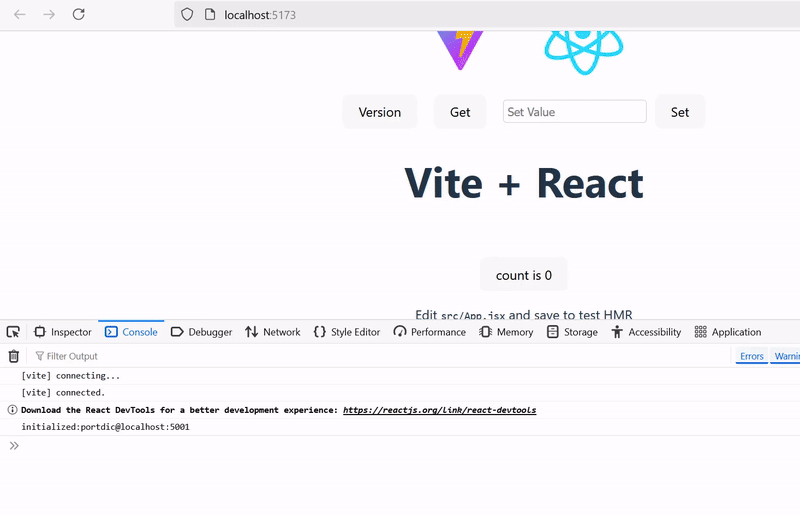

# What's PortDic
PortDic is a key-value pair data structure storage object provided by Port. Users can quickly look up values using keys, allowing for efficient data retrieval. This structure enables the storage and editing of multiple data structures, facilitating more stable and reliable development.

## Download  
NAME | Language |Package Manager | OS | STABLE | 
------|--------|--------|--------|--------
portdic |  C++ | not yet |Windows| No | 
portdic |  Delphi | not yet |Windows| No |
portdic |  C# | nuget |Windows| Yes | 
portdic |  Python | not yet |Windows| No | 
portdic |  Javascript | npm |Any | Yes | 

## React (With vite)

___
Download : [React project](file/react_sample_source.zip){:sample} 
___

### SET / GET
```Javascript

import { useState ,useEffect} from 'react'
import reactLogo from './assets/react.svg'
import viteLogo from '/vite.svg'
import './App.css'
import { CallPortdic } from 'portdic';

function App() {
  const [setValue, setSetValue] = useState("");
  const [count, setCount] = useState(0) 
  const [portdic, setPortdic] = useState(0); 
  useEffect(() => {
    CallPortdic("localhost:5001").then(setPortdic).catch(console.error); 
  }, []); 
  return (
    <>
      <div>
        <a href="https://vite.dev" target="_blank">
          
        </a>
        <a href="https://react.dev" target="_blank">
          
        </a>
      </div>
      <div style={{ display: "flex", gap: "20px", alignItems: "center" }}> 
      <button
        onClick={() => {
          const data = portdic.Execute("version");

          data
            .then((resp) => resp.json())
            .then((data) => {
              console.log("success received:", data);
            })
            .catch((error) => {
              console.error("error occurred:", error);
            });
        }}
      >
      Version
      </button> 
      <button
        onClick={() =>
          console.log(portdic.Get("room1", "RoomTemp3"))
        }
      >
        Get
      </button> 
      <div style={{ display: "flex", gap: "10px", alignItems: "center" }}>
        <input
          type="text"
          placeholder="Set Value"
          value={setValue}
          onChange={(e) => setSetValue(e.target.value)}
          style={{
            padding: "5px",
            fontSize: "14px",
            borderRadius: "4px",
            border: "1px solid #ccc",
          }}
        />
        <button
          onClick={() => {
            portdic.Set("room1", "RoomTemp3", setValue);
            console.log(`Set value: ${setValue}`);
          }}
        >
          Set
        </button>
      </div>
    </div>
      <h1>Vite + React</h1>
      <div className="card">
        <button onClick={() => setCount((count) => count + 1)}>
          count is {count}
        </button>
        <p>
          Edit <code>src/App.jsx</code> and save to test HMR
        </p>
      </div>
      <p className="read-the-docs">
        Click on the Vite and React logos to learn more
      </p>
    </>
  )
}
export default App 
```  

### It's working!



## .Net 

### Run
```C#
  ...
  private static IPortDic port = Port.GetDictionary("sample");

  public Form()
  {
     InitializeComponent();
     //  
     port.OnOccurred += Port_OnOccurred;
     port.OnStatusChanged += Port_OnStatusChanged;
     //
     port.Run(); 
  }
  
  /// <summary>
  /// The OnStatusChanged event is typically used to notify when the status of an port server
  /// has changed. 
  /// This event provides details about the event through <see cref="PortStatusHandler"/>.
  /// </summary>
  private void Port_OnStatusChanged(object sender, PortStatusArgs e)
  {
      switch (e.Status)
      {
          case PortStauts.Initializing:
              break;
          case PortStauts.Running:
              OnReady = true;
              break;
          case PortStauts.Stopped:
              break;
          case PortStauts.Shutdown:
              break;
          case PortStauts.Failed:
              break;
      }
  }

  /// <summary>
  /// The OnStatusChanged event is typically used to notify when the status of an port server
  /// has changed. 
  /// This event provides details about the event through <see cref="PortStatusHandler"/>.
  /// </summary>
  private void Port_OnOccurred(object sender, PortEventArgs e)
  {
      switch (e.EventType)
      {
          default:
              Console.WriteLine(e.Message);
              break;
      }
  }
  ...
```

### Test Package 
```C#
 ...
  private static IPortDic port = Port.GetDictionary("sample");

  public Form()
  {
    InitializeComponent();
    // Test Mode Heater Class with messaegs.
    port.Test("Heater1", new Heater());

    port.OnOccurred += Port_OnOccurred;
    port.OnStatusChanged += Port_OnStatusChanged;
    //
    port.Run();
  }
  ...
```
### SET/GET

```C#
    ...
    
    var ok = dic.Set('room1','BulbOnOff','On');
    if(ok){
        Console.WriteLine("ok");
    } 

    // 'On'
    Console.WriteLine(dic.Get('room1','BulbOnOff').Text()); 

    port["room1"].Set("BulbOnOff", 'Off'); 

    // 'Off'
    Console.WriteLine(dic.Get('room1','BulbOnOff').Text()); 
   

    var t1 = dic.Get('room1','RoomTemp1')
    // random number unit Celsius
    Console.WriteLine(t1.Text()); 

     var t2 = dic.Get('room1','RoomTemp2')
    // random number unit Fahrenheit
    Console.WriteLine(t2.Text()); 
    ...
``` 
<!-- ### QUEUE


```C#

    //class1.cs
     private static IPortDic port = Port.GetDictionary("sample");

    dic.Create(PortDic.Structure.Queue,'TEST')

    var q1 = dic.Queque('TEST') 
    
    q1.Enqueue(Encoding.UTF8.GetBytes('First Value'));

    ...


    //class2.cs
     private static IPortDic port = Port.GetDictionary("sample");

    var q1 = dic.Queue('TEST')

    var v = q1.Dequeue();

    //Show "First Value" from class1.cs 
    Console.WriteLine(Encoding.UTF8.GetString(v));

    v = q1.Dequeue();
    //Show ""
    Console.WriteLine(Encoding.UTF8.GetString(v));
    
    ...
    
```
### STACK

```C#

    //class1.cs
     private static IPortDic port = Port.GetDictionary("sample");

    dic.Create(PortDic.Structure.Stack,'TEST')

    q1.Push(Encoding.UTF8.GetBytes('First Value'));

    ...


    //class2.cs
     private static IPortDic port = Port.GetDictionary("sample");

    var stack = Port.Stack('TEST')

    var v = stack.Pop();

    Console.WriteLine(Encoding.UTF8.GetString(v));
    
    ...
    
```
### LIST

```C#

    //class1.cs
    
     private static IPortDic port = Port.GetDictionary("sample");
    
    dic.Create(PortDic.Structure.List,'TEST')
    
    var list = Port.List('TEST')

    list.Add(Encoding.UTF8.GetBytes('First Value'));

    ...


    //class2.cs
     private static IPortDic port = Port.GetDictionary("sample");

   var list = Port.List('TEST')

    var v = list.Get(0);

    //Show "First Value" from class1.cs 
    Console.WriteLine(Encoding.UTF8.GetString(v));
    //Remove index 0
    q1.Remove(0);
    
    ...
    
```
### STORAGE

```C#

    //class1.cs
     private static IPortDic port = Port.GetDictionary("sample");

    dic.Create(PortDic.Structure.Storage,'TEST')
    
    var s = Port.Storage('TEST')

    if (s.Set('A',Encoding.UTF8.GetBytes('First Value'))){
        Console.WriteLine('Updated value')
    }

    ...


    //class2.cs
     private static IPortDic port = Port.GetDictionary("sample");

    var s = Port.Storage('TEST')

    var v = s.Get('A');

    //Show "First Value" from class1.cs 
    Console.WriteLine(Encoding.UTF8.GetString(v));
 
    ...
    
```
 -->
