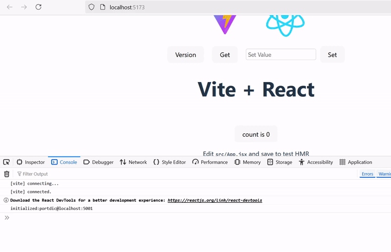

# React Integration

## Table of Contents
1. [Overview](#overview)
2. [Quick Link](#quick-link)
3. [React Integration with Vite](#react-integration-vite)
4. [Sample Project Setup](#react-sample-setup)
5. [React Implementation](#react-implementation)
6. [React Integration Demo](#react-integration-demo)

## Overview

React integration provides seamless connectivity between React applications and Port Application services. This guide covers setting up React projects with Vite and implementing Port Application functionality.

## React Integration with Vite {#react-integration-vite}

### Sample Project Setup {#react-sample-setup}

**Download Sample:**
[React Project Sample](file/react_sample_source.zip)

### React Implementation {#react-implementation}

```javascript
import { useState, useEffect } from 'react'
import reactLogo from './assets/react.svg'
import viteLogo from '/vite.svg'
import './App.css'
import { CallPortdic } from 'portdic';

function App() {
  const [setValue, setSetValue] = useState("");
  const [count, setCount] = useState(0) 
  const [portdic, setPortdic] = useState(0); 
  
  useEffect(() => {
    CallPortdic("localhost:5001").then(setPortdic).catch(console.error); 
  }, []); 
  
  return (
    <>
      <div>
        <a href="https://vite.dev" target="_blank">
          
        </a>
        <a href="https://react.dev" target="_blank">
          
        </a>
      </div>
      <div style={{ display: "flex", gap: "20px", alignItems: "center" }}> 
        <button
          onClick={() => {
            const data = portdic.Execute("version");
            data
              .then((resp) => resp.json())
              .then((data) => {
                console.log("success received:", data);
              })
              .catch((error) => {
                console.error("error occurred:", error);
              });
          }}
        >
          Version
        </button> 
        <button
          onClick={() =>
            console.log(portdic.Get("room1", "RoomTemp3"))
          }
        >
          Get
        </button> 
        <div style={{ display: "flex", gap: "10px", alignItems: "center" }}>
          <input
            type="text"
            placeholder="Set Value"
            value={setValue}
            onChange={(e) => setSetValue(e.target.value)}
            style={{
              padding: "5px",
              fontSize: "14px",
              borderRadius: "4px",
              border: "1px solid #ccc",
            }}
          />
          <button
            onClick={() => {
              portdic.Set("room1", "RoomTemp3", setValue);
              console.log(`Set value: ${setValue}`);
            }}
          >
            Set
          </button>
        </div>
      </div>
      <h1>Vite + React</h1>
      <div className="card">
        <button onClick={() => setCount((count) => count + 1)}>
          count is {count}
        </button>
        <p>
          Edit <code>src/App.jsx</code> and save to test HMR
        </p>
      </div>
      <p className="read-the-docs">
        Click on the Vite and React logos to learn more
      </p>
    </>
  )
}

export default App
```

### React Integration Demo {#react-integration-demo}



 