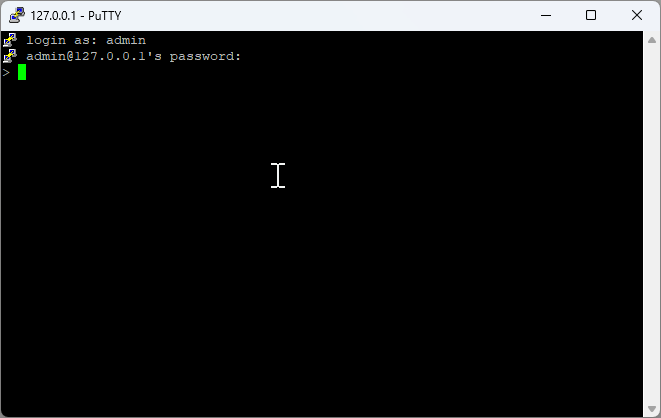

# Remote Access

## SSH Protocol Overview {#ssh-overview}

SSH (Secure Shell) provides secure remote access to Port systems for administration and monitoring.

## SSH Client Setup {#ssh-client-setup}

### PuTTY Installation {#putty-installation}

PuTTY is a free, open-source terminal emulator supporting SSH, Telnet, and other network protocols.

!!! tip "Download PuTTY"
    [Download PuTTY Application](https://www.chiark.greenend.org.uk/~sgtatham/putty/latest.html)

## SSH Connection Process {#ssh-connection}

### 1. Connection Configuration {#ssh-connection-config}


**Connection Details:**
- **Host**: `127.0.0.1`
- **Port**: `22`
- **Protocol**: SSH

!!! note "Default Credentials"
    - **Username**: `admin`
    - **Password**: `admin`

### 2. Authentication {#ssh-authentication}



Enter your credentials when prompted to establish the secure connection.

### 3. Command Execution {#ssh-commands}


Once connected, you can execute various Port commands remotely:
- View system status
- Access log files
- Monitor project operations
- Perform administrative tasks

## Remote Command Examples

### Basic System Commands

```bash
# Check server status
status

# Get server uptime
uptime

# Measure network latency
latency
```

### Data Access Commands

```bash
# Get data from server
get Equipment Status
get SECS Temperature
get MyProject.log

# Set data on server
set Equipment Status RUNNING
set SECS CommState ENABLED
set Process Temperature 150.5
```

### Log Access Commands

```bash
# Access project logs
get sample.log
get MyProject.log

# Access package logs
get SECS.log
get GEM.log

# Access system events
get SECS.event
get GEM.event
```

### Administrative Commands

```bash
# User management
set password admin oldpass newpass123
set grant operator 2

# System notifications
set notify "Process completed successfully"

# Package operations
set init SECS
set init GEM
```

## SSH Security Best Practices

### Connection Security

1. **Change Default Credentials**: Always change default username/password
2. **Use Strong Passwords**: Implement complex password policies
3. **Enable Key-based Authentication**: Use SSH keys instead of passwords when possible
4. **Limit Access**: Restrict SSH access to authorized users only

### Network Security

1. **Firewall Configuration**: Configure firewall rules for SSH access
2. **Port Configuration**: Consider changing default SSH port (22)
3. **IP Whitelisting**: Restrict access to specific IP addresses
4. **VPN Integration**: Use VPN for additional security layer

### Session Management

1. **Session Timeout**: Configure automatic session timeout
2. **Connection Monitoring**: Monitor active SSH connections
3. **Audit Logging**: Enable comprehensive SSH audit logging
4. **Failed Login Protection**: Implement failed login attempt protection

## Troubleshooting SSH Connections

### Common Connection Issues

#### Connection Refused
```bash
# Check if SSH service is running
get status

# Verify port configuration
get config ssh_port
```

#### Authentication Failures
```bash
# Verify user credentials
get user admin

# Check authentication logs
get auth.log
```

#### Network Connectivity
```bash
# Test network connectivity
ping 127.0.0.1

# Check firewall status
get firewall status
```

### Error Resolution

| Error | Cause | Solution |
|-------|-------|----------|
| Connection timeout | Network/firewall issue | Check network connectivity and firewall rules |
| Authentication failed | Wrong credentials | Verify username/password |
| Permission denied | User access restrictions | Check user permissions and access rights |
| Host key verification failed | SSH key mismatch | Update or remove old host keys |

## Advanced SSH Features

### SSH Tunneling

Create secure tunnels for accessing internal services:

```bash
# Local port forwarding
ssh -L 8080:localhost:5001 admin@127.0.0.1

# Remote port forwarding
ssh -R 9090:localhost:5001 admin@127.0.0.1
```

### SSH File Transfer

Transfer files securely using SSH protocols:

```bash
# Using SCP (Secure Copy)
scp file.txt admin@127.0.0.1:/remote/path/

# Using SFTP (SSH File Transfer Protocol)
sftp admin@127.0.0.1
```

### SSH Key Management

Generate and manage SSH keys for enhanced security:

```bash
# Generate SSH key pair
ssh-keygen -t rsa -b 4096

# Copy public key to server
ssh-copy-id admin@127.0.0.1
```

## Integration with Port Applications

### Remote Monitoring

Monitor Port applications remotely through SSH:

```bash
# Monitor system resources
get system resources

# Check application health
get health status

# View real-time logs
get logs --follow
```

### Remote Configuration

Configure Port applications remotely:

```bash
# Update configuration
set config parameter value

# Restart services
set service restart

# Deploy updates
set deploy package_name
```

### Remote Debugging

Debug Port applications remotely:

```bash
# Enable debug mode
set debug enabled

# View debug logs
get debug.log

# Set breakpoints
set breakpoint function_name
``` 