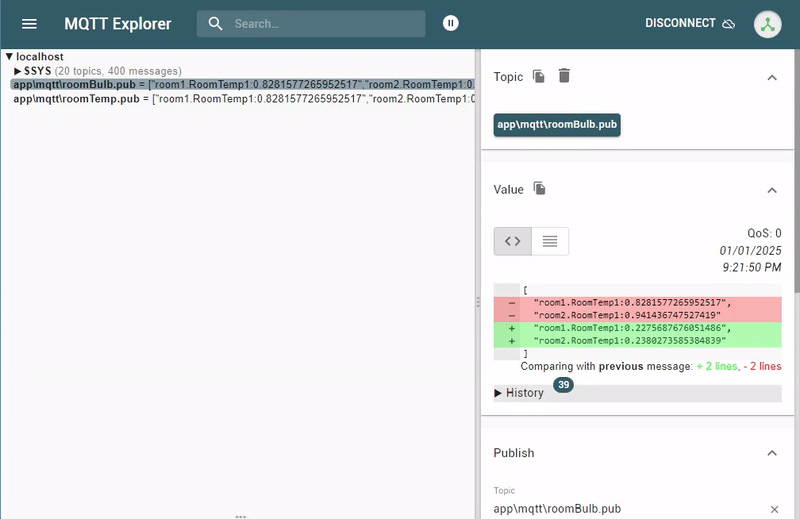

# MQTT

## Overview

PortDIC supports MQTT in two complementary modes:

| Mode | Interface | Use Case |
|------|-----------|----------|
| **Embedded Broker** | `MQTT` via `Port.BroadCast<MQTT>()` | Run an MQTT broker inside your process — no external server needed |
| **Client Handler** | `IMQTTHandler` via `[MQTTHandler]` / `[MQTTHandlerProp]` | Connect to any external MQTT broker; pub/sub with full event callbacks |

---

## Embedded Broker Mode

The `MQTT` broadcast handler starts an embedded MQTT broker inside the PortDIC process. Configure it with `PortApplication.CreateBuilder()` and obtain it via `Port.BroadCast<MQTT>()`.

### Quick Setup

```csharp
using Portdic;

var config = PortApplication.CreateBuilder()
    .New(BroadcastType.MQTT)
    .MqttAddress("127.0.0.1:8080")
    .Users(new User("admin", "admin"))
    .AllowRemotes("127.0.0.1")
    .UseMqttProtocol(false)   // false = WebSocket, true = native MQTT/TCP
    .Build();

var mqtt = Port.BroadCast<MQTT>();
Port.Run();
```

### Multi-User Production Setup

```csharp
var config = PortApplication.CreateBuilder()
    .New(BroadcastType.MQTT)
    .MqttAddress("0.0.0.0:1883")
    .Users(
        new User("admin", "admin123"),
        new User("sensor01", "sensor_pass"),
        new User("client_app", "app_secret")
    )
    .AllowRemotes("192.168.1.0/24", "10.0.0.100")
    .UseMqttProtocol(true)    // native MQTT over TCP
    .Build();

var mqtt = Port.BroadCast<MQTT>();
Port.Run();
```

### Broker Configuration Reference

| Method | Type | Default | Description |
|--------|------|---------|-------------|
| `MqttAddress(address)` | `string` | `"127.0.0.1:8080"` | Broker listen address in `host:port` format |
| `Users(params User[])` | `User[]` | *(required)* | Authorized users. First entry is the master user |
| `AllowRemotes(params string[])` | `string[]` | *(required)* | Allowed client IPs, hostnames, or CIDR ranges |
| `UseMqttProtocol(bool)` | `bool` | `true` | `true` = native MQTT/TCP; `false` = MQTT over WebSocket |

### `User` class

```csharp
new User("username", "password")
new User()   // defaults: name="admin", password="admin"
```

### Transport Modes

| `UseMqttProtocol` | Transport | Typical Port | Use Case |
|-------------------|-----------|--------------|----------|
| `true` | Native MQTT over TCP | 1883 / 8883 | MQTT clients, edge devices |
| `false` | MQTT over WebSocket | 8080 | Browser-based clients, dashboards |

### Monitoring with MQTT Explorer

[MQTT Explorer](https://mqtt-explorer.com/) provides a visual interface to inspect topics and messages in real time.

| Field | Value |
|-------|-------|
| Host | `127.0.0.1` |
| Port | `8080` (WebSocket) or `1883` (MQTT) |
| Username | `admin` |
| Password | `admin` |




### Publication File

Create a `.pub` file to declare which PortDIC data keys are published to MQTT topics:

**File path:** `app/mqtt/room1.pub`

```text
room1 RoomTemp1   // [group-name] [message-name]
room2 RoomTemp1
```

---

## Client Handler Mode

The handler pattern creates one independent MQTT client per class registration. This mode is backed by `portmqttclient.dll`  and supports publish, subscribe, and full connection event callbacks.

### 1. Define an MQTT client class

```csharp
using Portdic;
using Portdic.MQTT;

[MQTTHandler]
public class SensorClient
{
    [MQTTHandlerProp]
    public IMQTTHandler handler { get; set; } = null!;

    [Preset]
    private void Preset()
    {
        handler.SetHost("192.168.1.50");
        handler.SetPort(1883);
        handler.SetClientId("sensor-client-01");
        handler.SetUsername("user");
        handler.SetPassword("pass");

        handler.OnMessageReceived += OnMessage;
        handler.OnEvent += OnEvent;
    }

    private void OnMessage(string name, string topic, string payload, int qos)
    {
        Console.WriteLine($"[{name}] {topic}: {payload} (QoS {qos})");
    }

    private void OnEvent(string name, string eventType, string description)
    {
        Console.WriteLine($"[{name}] {eventType}: {description}");
        if (eventType == "CONNECTED")
        {
            handler.Subscribe("sensor/temperature/#");
            handler.Subscribe("sensor/humidity", qos: 1);
        }
    }
}
```

### 2. Register and run

```csharp
Port.Add<SensorClient>("mqtt_sensor");
Port.Run();
```

### Multiple broker connections

Each registration creates its own independent MQTT client:

```csharp
Port.Add<LocalBrokerClient>("mqtt_local");
Port.Add<CloudBrokerClient>("mqtt_cloud");
Port.Run();
```

### Publish and Subscribe

```csharp
// Subscribe to a topic
handler.Subscribe("equipment/status");
handler.Subscribe("sensor/#", qos: 1);     // wildcard, QoS 1

// Publish a message
handler.Publish("equipment/status", "online");
handler.Publish("sensor/temp", "25.3", qos: 1, retain: true);

// Unsubscribe
handler.Unsubscribe("sensor/#");

// Disconnect
handler.Close();
```

---

## QoS Levels

| Level | Guarantee | Description |
|-------|-----------|-------------|
| **QoS 0** | At most once | No delivery guarantee; possible message loss |
| **QoS 1** | At least once | Guaranteed delivery; possible duplication |
| **QoS 2** | Exactly once | Guaranteed delivery without duplication |

---

## API Reference

### Attributes

| Attribute | Target | Description |
|-----------|--------|-------------|
| `[MQTTHandler]` | Class | Marks the class as an MQTT client handler container |
| `[MQTTHandlerProp]` | Property | Injects the `IMQTTHandler` instance |
| `[Preset]` | Method | Called before `Open()` to configure the handler |

### Configuration methods

| Method | Description |
|--------|-------------|
| `SetHost(string host)` | Broker address. Default: `"127.0.0.1"` |
| `SetPort(int port)` | Broker port. Default: `1883` |
| `SetClientId(string clientId)` | MQTT client ID. Defaults to the registration key if empty |
| `SetUsername(string username)` | Broker authentication username |
| `SetPassword(string password)` | Broker authentication password |
| `SetKeepAlive(int seconds)` | Keep-alive interval in seconds. Default: `60` |
| `SetCleanSession(bool)` | Discard previous session state on connect. Default: `true` |

### Connection methods

| Method | Returns | Description |
|--------|---------|-------------|
| `Open()` | `ERROR_CODE` | Connect to the MQTT broker |
| `Close()` | `ERROR_CODE` | Disconnect from the broker |
| `IsConnected` | `bool` | `true` if currently connected to the broker |

### Publish / Subscribe methods

| Method | Returns | Description |
|--------|---------|-------------|
| `Publish(topic, payload, qos, retain)` | `int` | Publish a message. Returns `0` on success |
| `Subscribe(topic, qos)` | `int` | Subscribe to a topic filter. Returns `0` on success |
| `Unsubscribe(topic)` | `int` | Unsubscribe from a topic. Returns `0` on success |

### Logging

| Method | Description |
|--------|-------------|
| `SetLogger(string rootPath)` | Enable hourly-rotated log files. Format: `mqtt_{name}_{date}_{hour}.log` |
| `WriteLog(string message)` | Write a custom entry to the log file |

---

## Events

### `OnMessageReceived`

Fired when a message arrives on a subscribed topic.

```csharp
handler.OnMessageReceived += (string name, string topic, string payload, int qos) =>
{
    Console.WriteLine($"[{name}] {topic}: {payload}");
};
```

| Parameter | Description |
|-----------|-------------|
| `name` | Client registration key |
| `topic` | Topic the message was published on |
| `payload` | Message payload as a UTF-8 string |
| `qos` | QoS level (0, 1, or 2) |

### `OnEvent`

Fired on connection state changes and errors.

```csharp
handler.OnEvent += (string name, string eventType, string description) =>
{
    Console.WriteLine($"[{name}] {eventType}: {description}");
};
```

| `eventType` | Triggered When |
|-------------|----------------|
| `CONNECTED` | Connected to the broker |
| `DISCONNECTED` | Disconnected from the broker |
| `SUBSCRIBED` | Topic subscription confirmed |
| `UNSUBSCRIBED` | Topic unsubscription confirmed |
| `PUBLISHED` | Message published successfully |
| `ERROR` | Error occurred (`description` contains detail) |

---

## Error Codes

| Code | Value | Meaning |
|------|-------|---------|
| `ERR_CODE_NO_ERROR` | `1` | Success |
| `ERR_CODE_OPEN` | `-1` | Open/connect failed |
| `ERR_CODE_DLL_NOT_LOADED` | `-2` | `portmqttclient.dll` not loaded |
| `ERR_CODE_PORTNAME_EMPTY` | `-3` | Client name not set |
| `ERR_CODE_DLL_FUNC_NOT_CONFIRM` | `-4` | Required DLL function unavailable |
| `ERR_CODE_CONNECT_FAILED` | `-5` | Connection attempt failed |

---

## Related

- [RTSP](rtsp) — Real-time video streaming
- [SECS/GEM](secs) — Semiconductor equipment protocol
- [TCP](tcp) — Raw TCP client/server communication
